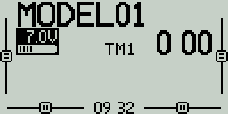
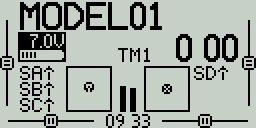
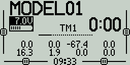
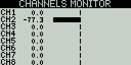

# 🚧 Main View

The main view is the default view during radio operation. This view displays information such as the model name, trim positions, transmitter battery voltage, flight mode, receiver signal strength, and Timers. There are five main view screens.

<figure><figcaption>
Screen 1
</figcaption></figure>

 

<figure><figcaption>
Screen 2
</figcaption></figure>

 

<figure><figcaption>
Screen 3
</figcaption></figure>

<figure><figcaption>
Screen 4
</figcaption></figure>

 

<figure><figcaption>
Screen 5
</figcaption></figure>

### Screens

**Screen 1** - This view displays the model name, trim positions (if trims are enabled), transmitter battery voltage, flight mode, receiver signal strength, and Timers 1 and 2 (if enabled).

**Screen 2** - This view displays the model name, trim positions (if trims are enabled), transmitter battery voltage, flight mode, receiver signal strength, and Timer 1 (if enabled). It also has a graphical representation of the stick, pot, and positions.

**Screen 3** - This view displays the model name, trim positions (if trims are enabled), transmitter battery voltage, flight mode, receiver signal strength, and Timer 1 (if enabled). It also shows the numerical values of the output channels, 8 channels per page. Use the **\[Roller]**or **\[Dial]** to scroll thru the additional pages.&#x20;

**Screen 4** - This view displays the model name, trim positions (if trims are enabled), transmitter battery voltage, flight mode, receiver signal strength, and Timer 1 (if enabled). It also shows the values of output channels as a bar graph, 8 channels per page. Use the **\[Roller]** or **\[Dial]** to scroll thru the additional pages.&#x20;

**Screen 5** - This view shows either the channel monitor or mixer monitor, 8 channels per page. Use the roller or dial to scroll thru the additional pages. Push the **\[Roller]** or **\[Dial]** button to switch between the channel monitor and mixer monitor.

Long pressing the **\[Roller]** or **\[Dial]** button from the main view screen will show a pop-up menu with the options below:

### Reset

### Statistics

<figure><figcaption>
Statistics screen
</figcaption></figure>

The **Statistics** screen presents you with statistics regarding radio usage. Except for Battery, all data is reset once the radio is powered off. The following information is provided:

* **SES** - The amount of time that the radio has been turned on.&#x20;
* **THR**  - The amount of time that the throttle has was above the 0% stick position.
* **TH%** - The amount of time that the throttle has was above the 50% stick position.
* **TM1/2/3** - The current values of Timer 1, Timer 2, Timer 3.
