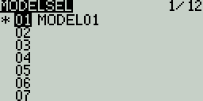

# Model Settings

### Model Select

Pressing the **\[MDL]** button from the Main view will open the **Model Select** screen. &#x20;

<figure><figcaption>
Model Select screen
</figcaption></figure>

Use the **\[Roller]** or **\[Dial]** to scroll through the model slots.

Pressing **\[Enter]** on an empty model slot will give you the following options:

* **Create Model** - This option creates a new model with the default configuration options.
* **Restore Model** - This option creates a new copy of a selected model that has been previously backed up.

Pressing **\[Enter]** on an occupied model slot that is not the active model (not marked with an asterix **\***) will give you the following options:

* **Select Model** - this option selects this model as the active model.
* **Backup Model** - This option makes a copy of the model in the **Backup** folder on the SD Card.
* **Copy Model** - This option makes an exact copy of the model and allows you to select which model slot it will be placed in.
* **Move Model** - This option allows you to move the selected model to a different model slot.
* **Delete Model** - This option deletes the selected model.

Pressing **\[Enter]** on an occupied model slot that is the active model (marked with an asterix **\***) will give you the following options:

* **Move Model** - This option allows you to move the selected model to a different model slot.
* **Copy Model** - This option makes an exact copy of the model and allows you to select which model slot it will be placed in.
* **Backup Model** - This option makes a copy of the model in the **Backup** folder on the SD Card.

Pressing the **\[PAGE>]** button will take you to the **Setup** screen.
