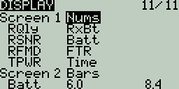
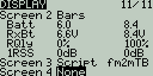
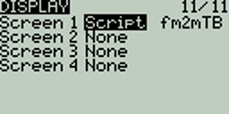
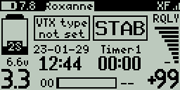

# Display

The **Display** screen is where you configure the telemetry screens shown when pressing the **\[Tele]** button from the main screen.

You can configure up to Four telemetry screens. You can choose one of the following display types for each screen:

**Nums** (Numbers) - The _**numbers**_ type displays the number value of the selected telemetry sensor or other configured object. The screen will be divided into two columns with four rows - each cell can display the data from a different sensor or object.  On the display screen, the top bar will show the model name, radio battery voltage, and time in addition to the configured cells. If _**Timer1**_ is configured in the model, then it will replace the model name in the top bar.

<figure><figcaption>
Display Numbers Configuration
</figcaption></figure>

 

<figure><figcaption>
Display Screen with Numbers
</figcaption></figure>

**Bars** - The _**Bars**_ type displays a bar graph representing the value of the selected telemetry sensor or other configured object. The screen will be divided into four rows - each row can display the data from a different sensor or object. For each sensor, you must define the minimum and maximum values for the bars. On the display screen, the top bar will show the model name, radio battery voltage, and time in addition to the configured cells. If _**Timer1**_ is configured in the model, then it will replace the model name in the top bar. Additionally, a 5th bar will be shown at the bottom with the RSSI value.

<figure><figcaption>
Display Bars Configuration
</figcaption></figure>

 

<figure><figcaption>
Display Screen with Bars
</figcaption></figure>

**Script**-  The _**Script**_ type executes the telemetry Lua script that is configured. The telemetry Lua script must be located in the SD card folder: SD Card->Scripts->Telemetry in order to be available to be configured. &#x20;

<figure><figcaption>
Display Script Configuration
</figcaption></figure>

 

<figure><figcaption>
Display Screen with fm2m Lua Script
</figcaption></figure>


Additional Lua scripts for EdgeTX can be found here: [https://github.com/EdgeTX/lua-scripts](https://github.com/EdgeTX/lua-scripts)&#x20;


To configure the screens, scroll to the screen you want to configure and then press the **\[Enter]** button.  Then scroll to select the type of screen that you want to use and press the **\[Enter]** button to select it. Depending on the selected screen type, you can then configure the telemetry objects for each cell by scrolling to the desired object and selecting it by pressing the **\[Enter]** button. After all desired cells are configured, press the \[Return] button to exit out of the configuration menu.
