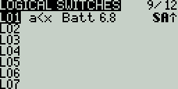

# Logical Switches

Logical Switches are virtual two-position switches whose values (ON/OFF or +100/-100) are based on the evaluation (true/false) of a defined logical expression. Once configured, logical switches can be used anywhere in EdgeTX that a physical switch can be defined.

The **Logical Switches** page shows you all the configured logical switches as well as an overview of their configured options.

<figure><figcaption>
Logical Switches Screen
</figcaption></figure>

Selecting a logic switch will give you the following options:

* **Edit** - Opens the Logical Switches configuration page for the selected logical switch.
* **Copy** - Copies the selected logical switch
* **Paste** - Pastes a copied logical switch onto the selected logical switch. Note: it will overwrite the selected logical switch.
* **Clear** - Deletes all configuration options for the selected logical switch.

<figure><figcaption>
Logical Switches Configuration Screen
</figcaption></figure>

After selecting to edit a logical switch, you will have the following configuration options:

* **Func** - The logical function that you want to use. See [Logical Switch Functions](logical-switches.md#logical\_switches\_judgment\_conditions\_and\_logical\_expressions) below for a description of the possible functions you can use.
* **V1** - The first variable in the expression to evaluate.
* **V2** -The second variable in the expression to evaluate.
* **AND switch** - Switch that must be active to allow the logical switch to be evaluated for activation.
* **Duration** - The duration that the logical switch will remain active (true) once meeting activation criteria.&#x20;
* **Delay** - Delay between when the activation criteria for the logical switch has been met and when the logical switch changes to the activated state (true).

### Logical Switch Functions 

In the expression, a and b represent sources (sticks, switches, etc.), and x represents the constants (values) to be compared.

<table><thead><tr><th width="137">Expression</th><th width="606">Description</th></tr></thead><tbody><tr><td>a=x</td><td>True when the source V1 is exactly the same as the constant V2.</td></tr><tr><td>a~x</td><td>True when the source V1 is about the same as the constant V2.</td></tr><tr><td>a>x</td><td>True when the source  V1 is greater than the constant V2.</td></tr><tr><td>a&#x3C;x</td><td>True when the source  V1 is less than the constant V2.</td></tr><tr><td>|a|>x</td><td>True when the absolute value of the source V1 is greater than the constant V2.</td></tr><tr><td>|a|&#x3C;x</td><td>True when the absolute value of the source V1 is less than the constant V2.</td></tr><tr><td>AND</td><td>True when both sources V1 and V2 are TRUE.</td></tr><tr><td>OR</td><td>True when either source V1 or V2 is TRUE.</td></tr><tr><td>XOR</td><td>True when the source V1 and V2 positions do not match.</td></tr><tr><td>Edge</td><td>Momentarily true when the source V1 has been active for the defined period of time and then deactivated. The first time field (T1) under V1 is the minimum active duration required for source V1 to activate the logical switch. The second time (T2) is the maximum time allowed for the source V1 to be active for the logic switch to be activated. When T2 is set to --, the logical switch will be true regardless of how long V1 has been active. When T2 is set to 3, if V1 is active for more than 3 seconds, the logical switch will not be set to true when the source is deactivated. When T2 is set to &#x3C;&#x3C;, the logical switch will be true when the time conditions in T1 are met without source V1 being deactivated.</td></tr><tr><td>a=b</td><td>True when source V1 is the same as source V2.</td></tr><tr><td>a>b</td><td>True if source V1 is greater than source V2.</td></tr><tr><td>a&#x3C;b</td><td>True if source V1 is less than source V2.</td></tr><tr><td>△>x</td><td>Momentarily true every time the source V1 changes by more than the amount indicated by the constant V2. </td></tr><tr><td>|△|>x</td><td>Momentarily true every time the absolute value of the source V1 changes by more than the amount indicated by the constant V2.</td></tr><tr><td>Tim (Timer)</td><td>Momentarily true every xxx seconds. Argument V1 is the duration that the logical switch is true (active). Argument V2 is the time between logical switch activations. Repeats timer cycle as long as the defined switch is active.</td></tr><tr><td>Stky (Sticky)</td><td>"Sticks" true after switch V1 is active (true) and stays active (true) regardless of V1 position until switch V2 is activated (true) and "unsticks" or deactivates (false) the logical switch.</td></tr></tbody></table>

Pressing the **\[PAGE>]** button will take you to the **Special Functions** screen.
