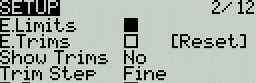
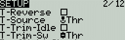
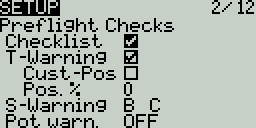
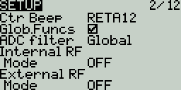

# Setup

<figure><figcaption></figcaption></figure>

The **Setup** screen is where you start to configure your model. It contains the following settings:

**Name** - Name of the model. The maximum number of characters is 10.

* To edit the text, using the **\[roller]** or **\[dial]**, press the button, scroll to select the desired letter, then press the button again to move to the next space. To toggle between lower and upper case, long-press the button. Press the **\[RTN]** button to exit out of text editing mode.

**Image** - Image displayed on the main view (only for radios with 212 x 64 displays).


Image dimensions shall be 64 x 32 pixels, 16 bit, grayscale, .bmp file. The image must be stored in the **IMAGES** folder of the SD card.


**Timer 1/2/3**  - There are 3 configurable timers in EdgeTX. They all have the same options:

#### Timer 1   \[Mode]   \[Switch]&#x20;

**\[Mode]**: The options include:

* **OFF**- The timer is not used
* **ON** - The timer runs all the time
* **Start** -The timer starts once the configured switch is activated. After the time is started, the timer ignores the switch position.
* **Throttle** - The timer starts once the throttle is raised and the configured switch is activated. The timer will stop counting if either the throttle position is lowered back to the minimum value or the configured switch is deactivated.
* **Throttle %** - The timer counts proportionally to the throttle. It counts in real-time at full throttle and half speed at 50% throttle.
* **Throttle Start** - The timer starts once the throttle is raised and the configured switch is activated. After starting, the timer ignores the throttle position and will keep counting unless the switch is deactivated.

**\[Switch]-** Select the switch that will trigger the timer to start.  If no switch is selected, the timer will trigger based only on the configured mode. In addition to a switch, you can also select a trim, a telemetry source (triggered when telemetry data is received from that source), or physical activity (stick movement or button press) (labeled as **ACT**)


Those items with a "!" mark in front of the trigger name mean that the condition is reversed. For example, "!SA-" means "when SA switch is not in middle/center position (= up or down)".


**Name:**  Name of the timer

**Start-** The time used for the timer's advanced functions.  The default value is 00:00 and when left as such, the timer operates like a stopwatch, counting upward until stopped.  If a different time is entered in this box, then the additional field will appear next to the time with the options: **Remain** or **Elaps**.

If set to **Remain**, the counter will function like a countdown timer - counting down from the designated time to zero and then alerting the user.  If set to **Elaps**, the timer functions like an alarm, counting up from zero until the designated time and then alerting the user.

**Persist (Persistence):**

* **Off** - The timer value is reset when switching models or when the radio is turned off / on.
* **Flight** - The timer value is NOT reset when switching models or when the radio is turned off / on. The timer value is only reset when the **Reset flight** option is selected in the [Reset](../main-view/reset.md) menu.
* **Manual Reset -** The timer value is reset only when it is individually selected to be reset (example: Reset timer1) in the [Reset](../main-view/reset.md) menu.

**Minute (Minute Call)** - If selected, you will be notified every minute that passes as described in the **Count Down** option.

**Count Down:**

* **Silent** - No notification is given until the timer reaches zero. When it reaches zero, you will hear one beep.
* **Beeps** - The radio will beep every second starting at the time designated.
* **Voice** - The radio will count down by second starting at the time designated.
* **Haptic** -The radio will vibrate every second starting at the time designated.

<figure><figcaption>
Trims settings
</figcaption></figure>

**E.Limits (Extended Limits)** - When enabled, it increases the minimum and maximum range for the output values to -150 and 150. Extended limits are necessary if the full range of the control surface cannot be reached with standard limits.

**E. Trims) Extended Trims**: Increases the maximum trim adjustment value from **±**25% to **±**100%.

**Reset** - This resets all trim values to zero.

**Show trims:** When set to **Yes**, it will display the numerical trim value on the trim bar.  When set to **CHANGE**, it will display the numerical value once the trim is no longer at zero.

**Trim Step:** Defines the amount of increase/decrease in trim when the trim switch is pressed.&#x20;

* Course = 1.6%
* Medium = 0.8%
* Fine = 0.4%
* Extra Fine = 0.2%
* Exponential = 0.2% near the center and the step value increases exponentially as the distance from the center increases.

<figure><figcaption>
Throttle Settings
</figcaption></figure>

**T-Reverse:** When enabled, this option reverses the output direction of the configured throttle channel.

**T-Source:** The source that will be used for the throttle.&#x20;

**T-Trim-Idle**: When enabled, the throttle trim will only affect the bottom portion of the throttle band.&#x20;


For example, with **Trim idle only** enabled, the throttle stick at the lowest point might have a value of -80 and the center point will still be 0 and the highest point of 100. Without this enabled, the throttle stick at the lowest point might have a value of -80 however, the center point will be 20 and the highest point of 100.&#x20;


**T-Trim-SW:** The trim switch that will be used to trim the throttle. It is possible to substitute the throttle trim switch with the aileron, rudder, or elevator trim switches.

<figure><figcaption>
Preflight Checks options
</figcaption></figure>

#### Preflight Checks

Whenever a new model is loaded, EdgeTX will conduct pre-flight checks based on the checks that are configured on this page. If any of the checks are failed, EdgeTX will give the user an audio and visual warning that must be acknowledged before using the model. The following preflight checks are configurable:

**Checklist** - When this option is selected, the model notes file will be displayed when the model is loaded. A valid model notes file must be in the **Models** folder on the SD card. The model notes file must be a .txt file and must have the EXACT same name as the model it is for, for example: Mobula6.txt. The text in the file is up to the user.

**T-Warning** - When selected, the radio will check that the throttle is at the minimum value for the configured throttle source in the **T-Source** configuration option.

**Cust-Pos** - When this option is selected, the value designated in **POS.%** will be used for the T.Warning.

**Pos.%** - minimum value of the throttle for the throttle warning when **Cust-Pos** is enabled.

**S-Warning** - The section displays all the switches that are configured on the radio and allows you to select which position is the correct position for the switch state check. Selecting the switch will cycle through the available switch positions or turn the check off for the switch completely.

**Pot warn**- When activated, this option checks the position of the pots & sliders. There are three options - OFF, ON and AUTO. When ON or AUTO is selected, buttons for the available pots and sliders will appear. To enable the Pot warning for an individual Pot, select the pot with the \[roller] or \[dial] and click the button to highlight it.  Highlighted pots are enabled.

* **OFF** - Pot and slider positions are not checked.
* **Manual** - Positions are checked against manually configured pot and slider positions. To manually set the check position, select **manual** the from menu, select the item that you want to set, and long-press the **\[Enter]** button to set its current position for the check.&#x20;
* **AUTO** - Positions are checked for pots and sliders and compared to the last automatically saved position before the radio was turned off or the model was changed.

<figure><figcaption></figcaption></figure>

**Ctr Beep** - Allows you to turn on/off the center beep function for the individual sticks, pots, and sliders by highlighting them with the **\[roller]** or **\[dial]** and pressing the button. When a switch is highlighted, the function is enabled.

**Glob. Funs** - When enabled, global functions programmed in the radio settings will apply to this model. When disabled, global functions will not apply to this model.


_Global functions_ are _special functions_ that are applied across all models. Refer to [Special _Functions_](../../edgetx-user-manual/user-manual-for-color-screen-radios/model-settings/special-functions.md) for information on configurable settings.


**ADC Filter** - Enables/disables the ADC filter for this model. The _**global**_ option will take the value designated in the radio settings, which is _on_ by default.


The ADC filter is a filter for the proportional channels (sticks, pots, sliders), smoothing out smaller fast movements that occur due to noise in the system electronics. Normally, this filter should be _disabled_ for models with flight controllers.


#### Internal / External RF

The configuration settings for both the Internal and External RF sections work the same. The only difference is that the **Internal RF** section is for configuring the built-in module and the **External RF** section is for configuring an RF module in the external module bay.

The configuration options are: _**off**_ or the _**module name**_ of the installed module as configured in the _**Radio**_ settings. Configuration options are unique to each installed module. Please consult the manufacturer's documentation for configuration options.&#x20;


Configuration options for the multi-protocol module are described here:  [https://www.multi-module.org/using-the-module/protocol-options](https://www.multi-module.org/using-the-module/protocol-options)


**Receiver number** - A receiver number is a user-assigned number for a model that is sent to the receiver when bound. Each model must have a unique receiver number. However, models using different protocols may have the same receiver number without issues.  EdgeTX will inform you when a receiver number is unique or if it is already being used with a text above the number field.


If using the radio in gamepad mode, both internal and external RF modules should be turned off. This will result in increased performance when connected to a computer via USB.&#x20;


**Trainer Mode** - Configures whether the radio will be used as the trainer or student radio and how the two radios will connect.  It has the following configurable options:

* **Off** - Trainer mode is not used for this model.&#x20;
* **Master / Jack** - Trainer radio using a cable connection.
* **Slave / Jack** - Student radio using a cable connection.
* **Master / Bluetooth** - Trainer radio using a Bluetooth connection (if installed in the radio).
* **Slave / Bluetooth** - Student radio using a Bluetooth connection (if installed in the radio).
* **Master / Multi** - Trainer radio using an additional externally mounted Multi-protocol module for the connection. For more information on this setup, see [set-up-wireless-trainer-with-mpm.md](../../set-up-wireless-trainer-with-mpm.md "mention")

Pressing the **\[PAGE>]** button will take you to the **Heli Setup** screen.
