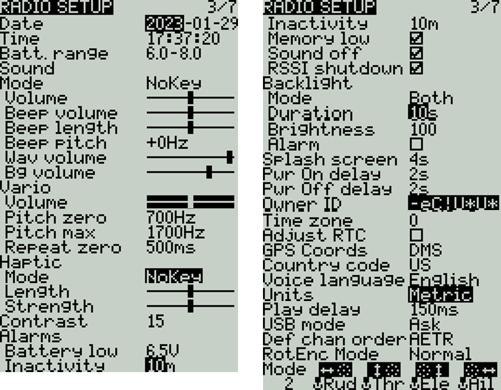

# Radio Setup

<figure><figcaption>
Radio Setup Screen
</figcaption></figure>

The **Radio Setup** screen is where you configure basic settings for your radio. It contains the following options:

**Date** - The current date.  This date is used for the SD card log files.

**Time** - The current time. This time is used for the SD card log files.

**Batt. range** - Sets the maximum and minimum voltage for the battery meter. This should be set based on the type of battery you are using.

### **Sound**&#x20;

**Mode** - configures when to play sounds.

* **All -** Beeps when the buttons are pressed and sounds are played when there are alerts or warnings.
* **No Key -** No beeps when buttons are pressed or the scroll wheel is turned but does play sounds when there are alerts or warnings. Also plays sounds triggered by special functions.
* **Alarm -** Only plays alarm or warning sounds. Also plays sounds triggered by special functions.
* **Quiet -** No Beeps or sounds are played.&#x20;

**Volume -** The master volume for the radio.

**Beep Volume** - Self-explanatory

**Beep Length** - Self-explanatory

**Beep Pitch** - Self-explanatory

**Wav volume -** The volume for alerts and warnings and sounds that are played with the **Play track** special function

**Bg volume -** The volume for background .wav files (music) that are played with the **BGMusic** special function

### **Vario**&#x20;

**Volume** - Volume for variometer beeps

**Pitch zero** - Low pitch frequency

**Pitch max** - High pitch frequency

**Repeat Zero -** The time before the tone repeats in milliseconds

### Haptic

**Mode** - configures when the radio vibrates.

* **All -** Vibrates when the buttons are pressed and when there are alerts or warnings.
* **No Key -** No vibrations when buttons are the pressed or scroll wheel is turned but does vibrate when there are alerts or warnings.&#x20;
* **Alarm -** Only vibrates for alarms or warning sounds.
* **Quiet -** No vibrations are made

**Length** - Duration of vibration.

**Strength** - Strength of vibration

**Contrast** - Screen contrast setting.

### Alarms

**Battery Low** - Voltage to trigger low battery alarm.

**Inactivity** - Time to trigger inactivity warning.

**Memory low** - Enable/disable low memory warning.

**Sound Off** - An "alarms disabled" visual warning is displayed when the transmitter is turned on if the sound mode is set to quiet.

**RSSI Shutdown** - Checks if a receiver is still connected to the radio on attempted shutdown. Makes a audio and visual alert if one is detected.&#x20;

### Backlight

**Mode**

* **Off** – Always off.
* **Keys** – Turns on when buttons are pressed.
* **Ctrl** – Turns on when sticks, switches, and knobs are used.
* **Both** – Turns on when buttons, sticks, switches, and knobs are used.
* **ON** – Always on.

**Duration** - The length in seconds that the backlight is on. The minimum value is 5 seconds. The maximum value is 600 seconds.

**Brightness** - Screen brightness level.

**Alarm** - The backlight turns on when there are alarms or warnings.

**Splash Screen** - Duration to display the splash screen.

**Power On delay** - The delay between when the power button is pushed and when the radio turns on. The options are: **0s, 1s, 2s, 3s**

**Pwr Off delay** - The delay between when the power button is pushed and when the radio shuts off. The options are: **0s, 1s, 2s, 3s, 4**s. _It is recommended to set at least a 1s delay in order to prevent the radio from being shut off in the case of an accidental button press._

**Owner ID** - Custom registration ID used only for users with ISRM modules.

**Time Zone** - Time zone radio is operated in.

**Adjust RTC** - Adjust the transmitter's real-time clock to match the time determined by the GPS.

**GPS Coords** - The GPS coordinate format that will be displayed.

**Country code** - Used by some RF modules to ensure adherence to local regulatory RF requirements. Options are **America, Japan, Europe.**

**Voice language** - Language for the voice pack. This setting and the voice pack folder on the SD card must match for the sounds to be played.

**Units** - Units of measure. Options are **metric** or **imperial**.

**Play delay** (sw. mid pos) - The minimum time in milliseconds a switch must be in the middle position before a special function will get activated. This is used to prevent the middle position from being activated on a three-position switch when switching from low position to high position.

**USB Mode** - Sets the default action when a USB cable is plugged into the USB data port and the radio is powered on.  Options are: **Ask**, **Joystick**, **Storage**, and **Serial**.

**RX Channel Order** - The default channel order for new models and the trainer screen.  The letters stand for: **A** = Aileron, **E** = Elevator, **T** = Throttle,  **R** = Rudder. Changing this setting does not affect existing models.

**RotEnc Mode** (Rotary Encoder Mode) - Set to **Normal** by default. The **Inverted** option reverses the direction of the roller.

**Mode** - The stick mode that will be used for the transmitter. Defined by what actions the left stick takes. The options are:

* 1: Left = yaw+pit (pitch)
* 2: Left = yaw+thr (throttle)
* 3: Left = rol (roll)+pit (pitch)
* 4: Left = rol (roll)+thr (throttle)

Pressing the **\[PAGE>]** button will take you to the **Global Functions** screen.
