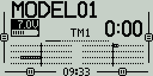

# Main View

The main view is the default view normally used during radio operation. This view displays information such as the model name, trim positions, transmitter battery voltage, flight mode, receiver signal strength, and Timers. A clock is also displayed in the center of the lower portion of all screens. There are five main view screens.

<figure><figcaption>
Screen 1
</figcaption></figure>

 

<figure><figcaption>
Screen 2
</figcaption></figure>

 

<figure><figcaption>
Screen 2 (Surafce Radios)
</figcaption></figure>

<figure><figcaption>
Screen 3
</figcaption></figure>

 

<figure><figcaption>
Screen 4
</figcaption></figure>

 

<figure><figcaption>
Screen 5
</figcaption></figure>

### Screens

**Screen 1** - This view displays the model name, trim positions (if trims are enabled), clock, transmitter battery voltage, flight mode, receiver signal strength, and Timers 1 and 2 (if enabled).

**Screen 2** - This view displays the model name, trim positions (if trims are enabled), clock,  transmitter battery voltage, flight mode, receiver signal strength, and Timer 1 (if enabled). It also has a graphical representation of the stick, pot, and switch positions. Use the **\[Roller]** or **\[Dial]** to scroll thru the additional pages. The second page shows the state of the [logical switches](../model-select/logical-switches.md).

**Screen 3** - This view displays the model name, trim positions (if trims are enabled), clock,  transmitter battery voltage, flight mode, receiver signal strength, and Timer 1 (if enabled). It also shows the values of output channels as a bar graph, 8 channels per page. Use the **\[Roller]**or **\[Dial]** to scroll thru the additional pages.&#x20;

**Screen 4** - This view displays the model name, trim positions (if trims are enabled), clock, transmitter battery voltage, flight mode, receiver signal strength, and Timer 1 (if enabled). It also shows the numerical values of the output channels, 8 channels per page. Use the **\[Roller]** or **\[Dial]** to scroll thru the additional pages.

**Screen 5** - This view shows either the channel monitor or mixer monitor, 8 channels per page. Use the roller or dial to scroll thru the additional pages. Push the **\[Roller]** or **\[Dial]** button to switch between the channel monitor and mixer monitor.

Long pressing the **\[Roller]** or **\[Dial]** button from the main view screen will show a pop-up menu with the options below:

* **View Notes -** Displays the configured model checklist. This option is only visible if a valid model checklist file is in the **Models** folder.
* **Reset** - See [Reset](reset.md) page.
* **Statistics** - See [Statistics](statistics.md) page.
* **About** - Displays the EdgeTX firmware version being used by the radio.

