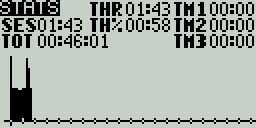
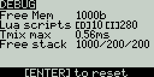
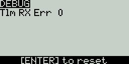

# Statistics

<figure><figcaption>
Statistics screen
</figcaption></figure>

The **Statistics** screen presents you with statistics regarding radio usage. All data is reset once the radio is powered off. The following information is provided:

* **SES** - The amount of time that the radio has been turned on.&#x20;
* **THR** - The amount of time that the throttle has been above the 0% stick position.
* **TH%** - The amount of time that the throttle has been above the 50% stick position.

Long pressing the **\[Roller]** or **\[Dial]** button will reset the Statistics and Debug screens.

Pressing **\[PAGE>]** will take you to the **Debug** screens.

<figure><figcaption>
Debug screen 1
</figcaption></figure>

 

<figure><figcaption>
Debug screen 1
</figcaption></figure>

The **Debug** screen provides data points used by the developers when debugging issues in the software. Most users will not find the information useful on this screen unless debugging issues with developers. The following debug information is provided.

* **Free mem** - Current free radio memory in bytes.
* **Lua scripts**&#x20;
  * **\[D] -** Maximum Lua duration in milliseconds.
  * **\[I]** - Maximum Lua interval in milliseconds.
* **TMix max** - Maximum mixer task duration.
* **Free stack - \[Menu] / \[Mix] /\[Audio]**&#x20;
  * **\[Menu]** - Minimum free stack memory for menu tasks.
  * **\[Mix]** - Minimum free stack memory for mixer tasks.
  * **\[Audio]** - Minimum free stack memory for audio tasks.
* **Tlm RX Err** - Numer of received telemetry errors
