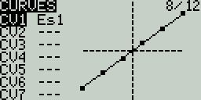
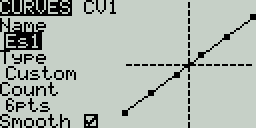
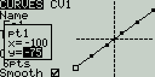

# Curves

The **Curves** screen allows you to define custom curves to use in the Inputs, Mixes, or Output screens. The curves screen will show the configured custom curves, with a graphical representation of each curve.

<figure><figcaption>
Curves Screen
</figcaption></figure>

Selecting one of the curves or empty curve slots will open the configuration page for that curve.

<figure><figcaption>
Curves Configuration Screen
</figcaption></figure>

### Curves Configuration

The curve configuration screen has the following configurable options:

* **Name** - Name for the curve. Only 3 characters are possible.
* **Type** - Type of curve: Options are **Standard** and **Custom**
  * **Standard** - Horizontal axis points are fixed values based on the number of points. Vertical axis points are adjustable.
  * **Custom** - Both horizontal and vertical axes are adjustable.
* **Count** - number of points in the curve. Press the **\[Enter]** button to modify the number of points. Long-pressing the **\[Enter]** button will give the following additional options:
  * **Preset** - Allows you to set the curve to one of the preset slope values (-45 to 45 degrees in 15 degree increments). The curve will have 5 points, and smoothing is not enabled by default.
  * **Mirror** - Mirrors the selected curve.
  * **Clear** - Clears all curve values from the selected curve.
* **Smooth** - When enabled, connects the points with curved lines instead of straight lines.

### Editing Curve Points

<figure><figcaption>
Editing Curve Points pop-up
</figcaption></figure>

After the last configuration option (Smooth), you will automatically begin to scroll through the configured points on the curve. To change the values of the points, press the **\[Enter]** button and then adjust the values as desired. For **Standard** curves, you will only be able to adjust the Y value. For **Custom** curves, you can adjust both the X and Y values.

Pressing the **\[PAGE>]** button will take you to the **Logical Switches** screen.
