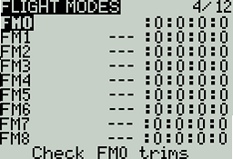
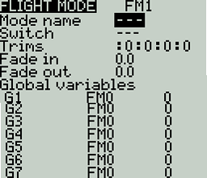
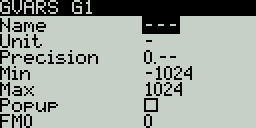

# Flight / Drive Modes

Flight modes (FM) and Drive modes (DM) (on surface radios) allow you to have different trim settings for each flight/drive mode. Once multiple flight/drove modes are configured, you can adjust the trim settings in each flight/drive mode without affecting the trim settings in other flight/drive modes (unless they are configured to do so). There are nine possible Flight/Drive modes, with flight/drive Mode 0 being the default mode.

<figure><figcaption>
Flight Modes Overview screen
</figcaption></figure>

The Flight/Drive Modes Overview screen shows an overview of the configured Flight/Drive Modes. The information below is displayed for each flight mode row:

* Mode #
* Mode Name
* Switch
* Trim settings (RETA)

**Check FM Trims:** When check FM trim is pressed, the trims for the current flight/drive mode are temporarily disabled. This is used to test the impact of the current flight/drive mode’s trims on the outputs.

<figure><figcaption>
Flight Mode Configuration screen
</figcaption></figure>

Selecting a flight/drive mode from the overview screen will open the configuration page, which has the following options:

**Name:** The custom name for the flight mode. If configured, this name will be shown on the upper left position of the main screen next to the battery voltage.

**Switch:** The trigger to enable that flight/drive mode. It can be a switch, pot, telemetry, trim or logical switch.

**Trims** - To configure the trims, select the trim that you want to configure (each column is one trim). Then scroll to select the flight/drive mode (**0-8**) that will provide the initial trim value and modifier (**=** or **+**). Select **--** to disable the trim.

When **3P** is selected instead of the flight mode **(0-8)**, the trim will act as a 3 position momentary switch.

_**Modifier**_ - there are two possible value modifiers **=** and **+.** The **=** modifier uses the trim value directly from the selected flight/drive mode. The **+** modifier uses the trim value from the selected flight/drive mode and then adds the trim value from the flight/drive mode you are configuring.

_Example 1:_ If you are configuring FM1 and set the value to =0, FM1 will have the trim value of the current value of the same trim in FM0. In this case, changes made to the trim in FM1 will also affect the trim in FM0 and vice-versa.

_Example 2:_ If you are configuring FM1 and set the value to +0, FM1 will have the trim value of the same trim in FM0, plus any trim changes made while in FM1. In this case, changes made to the trim in FM1 do not affect the trim in FM0. However, changes to trim values FM0 will affect trim values in FM1.

**Fade in:** Gradually change the trim value when this flight/drive mode is enabled. Specify the time in seconds (0.0 - 25.0) until the value change is completed.

**Fade out:** Gradually change the trim value when this flight/drive mode is disabled. Specify the time in seconds (0.0 - 25.0) until the value change is completed.


If the trim is turned off (**--**) on the setup page, you will not be able to adjust it at all on the main view screen.


### Global Variables

Global variables are variables whose values are shared across all the configuration screens of a model. Their values can be used in weights, offsets, differential, expo settings, outputs, and in logical switch comparisons.  The bottom portion of the flight/drive mode configuration screen shows an overview of each global variable for the selected flight/drive mode. For each global variable row, the following information is displayed:

* **Global Variable Number**: Displayed as **GV(1-9)**
* **Global Variable Name**: User-defined name for the global variable - up to three characters.
* **Mode:** Where the value of the global variable comes from. Options are:
  * **Own:** the global variable value for the selected flight/drive mode is manually defined in the **Value** text field.
  * **FM(1-9)** - global variable value for the selected flight/drive mode is inherited from the flight mode defined in the drop-down.
* **Value**: The current value of the global variable.

You can edit the value of the global variable by changing the value in the value text field.  Selecting the global variable number will open the global variable configuration screen will give you the following options:

<figure><figcaption>
Global Variables configuration screen
</figcaption></figure>

* **Name** - Name for the global variable. Three characters are allowed.&#x20;
* **Unit** - (optional) Allows you to add a **%** label to the displayed values when selected. It DOES NOT affect how the values are calculated.
* **Precision** - Allows you to select the number precision options whole numbers (**0.-**) and decimal (**0.0**). The default value is **0.-**
* **Min** - Defines the minimum that is allowed for the global variable.
* **Max** - Defines the maximum value that is allowed for the global variable.
* **Popup** - When enabled, a pop-up window will be displayed on the main screen when the value of this global variable changes during normal use.
* **FM1 -> FM8** - Allows you to select the global variable inheritance for the flight/drive mode. **Long press** the field to switch between **Own** and **Inheritence** mode. In **Own** mode, you can define the global variable value for the selected flight mode. In **Inheritance** mode, you can select the Flight Mode that the global variable will inherit the value from.

Pressing the **\[PAGE>]** button will take you to the **Inputs** screen.
