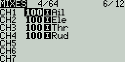

# Mixes

The **Mixes** screen  is where several Inputs can be combined into one "Channel Mix". These mixes are then assigned to a radio channel for output. This is also the place where switches, knobs or sliders are assigned to a channel for output. Similar to the Input section, it is also possible to assign a weight, offset or curve to a channel mix.

<figure><figcaption>
Mixes Page
</figcaption></figure>

The **Mixes** screen shows you an overview of your configured mixes. Each row represents a mixer line and displays the following information from left to right: channel, weight, input, mix name switch. These items are described in the [Mixes configuration options](mixes.md#mixes-configuration-options) area below.

Selecting an empty mix line and pressing **\[Enter]** will create a new mix and open the mixes configuration page.&#x20;

Selecting an existing mix line and pressing **\[Enter]** will toggle between **Copy/Paste** mode and **Move** mode. In **Copy/Paste** mode, a copy of the mix line is made, which can be pasted into the desired channel or mix line. In **Move** mode, the selected mix can be moved to a different channel. Press the **\[Return]** button to exit this mode.

Selecting an existing mix line and long-pressing **\[Enter]** will give you the following options:

* **Edit** - opens the mixes configuration page for that mix line.
* **Insert before** - Inserts a new mix line before the selected mix.
* **Insert after** - Inserts a new mix line after the selected mix.
* **Copy** - copies the selected mix line.
* **Move** - selects the mix line to be moved.
* **Delete** - deletes the selected mix line.

<figure><figcaption>
Mixes Configuration Screen
</figcaption></figure>

### Mixes Configuration Options

The right portion of the mixes configuration page contains a graph that shows the channel range for the mix.

When the **edit** option is selected for a mix, the following configuration options are available:

* **Mix Name** - Name of the mix (optional). Up to 6 characters are allowed.
* **Source** - The source for the mix. In addition to inputs, you can select sticks, pots, sliders, trims, physical and logical switches, heli mixer outputs, trainer import channel values, and other channels.
* **Weight**- Percentage of the source value to use. Long-pressing here will switch from numerical value to a global variable.
* **Offset** - The value added to or subtracted from the source.
* **Trim** - Specifies whether or not to include the trim values in this mix. For the trim values to be included, the trim field for the relevant input must also be enabled on **INPUTS** screen.
* **Curve** - Specifies the type of curve that will be used. See the **curve** section on the [Inputs](inputs.md) page for detailed explanations of the different curve types.&#x20;
* **Switch** - The physical switch that activates this mix line (optional). If no switch is selected, then the mix will be active by default.
* **Warning** -when selected, the radio will beep when this mix is active. You can choose from OFF or beep patterns 1, 2, 3.&#x20;
* **Multiplex** - The multiplex setting defines how the current mixer line interacts with the others on the same channel. **Add** will add its output to them, **Multiply** will multiply the result of the lines above it, and **Replace** will replace anything that was done before it with its output.&#x20;
* **Modes** - Specifies which flight modes this mix is active for. Visible modes are active.
* **Delay up** - Creates a time delay in seconds between when the source value increases and when it is output.
* **Delay down** -  Creates a time delay in seconds between when the source value decreases and when it is output.
* **Slow prec** (precision) - Changes the precision for Slow up/dn between 0.0 and 0.00.
* **Slow up** - Adjusts the transition speed for source value increases. Specify the time to transition from -100% to + 100% in seconds. You can specify a range from 0.00 seconds to 25.00 seconds.
* **Slow down** - Adjusts the transition speed for source value decreases. Specify the time to transition from -100% to + 100% in seconds. You can specify a range from 0.00 seconds to 25.00 seconds.

Pressing the **\[PAGE>]** button will take you to the **Outputs** screen.
