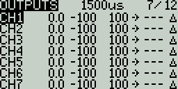
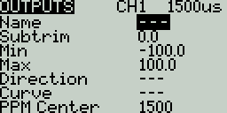

# Outputs

The **Outputs** screen is where final adjustments to the control data are made (including subtrims, curves, endpoint, and center values) before finally sending the control data to the RF module. This is where the channel center, limits (to prevent servo binding) and output direction are set.&#x20;


A **Trim** is a temporary adjustment to a flight control normally done while in operation with a trim switch. A **Subtrim** is a semi-permanant adjustment to a flight control that is normally configured when setting up the model in the output settings.&#x20;


<figure><figcaption>
Outputs screen
</figcaption></figure>

The output screen shows all the output channels. For each output line, it displays the values for the subtrim, minimum and maximum limits, direction, curve, and subtrim mode. After the last output line is the option **Trims=>Subtrims**. When this option is selected, it adds the current trim value to the subtrim value for each configured output. The trim value is then reset to zero.

Selecting an output line will give you the following options:

* **Edit** - Opens the output configuration screen.
* **Reset** - Sets the subtrim value back to zero. The trim value is not changed.
* **Cpy Trims -> Subtrim** - Adds the current trim value to the subtrim value.  The trim value is not changed.
* **Cpy Sticks -> Subtrim** - Adds the current value of the stick deflection as the subtrim value.
* **Cpy min/max to all -** Copies the settings in Min / Max field of selected channel to all other channels.

<figure><figcaption>
Outputs Configuration page
</figcaption></figure>

The output configuration screen has the following configuration options:

* **Name** - Name for the Output up to 6 characters.
* **Subtrim** - The subtrim value (max 100). It can also be set to a global variable by pressing the ldong-pressing the **\[Enter]** button to switch to GV Mode and then selecting the desire global variable.
* **Min** - Minimum output limit. Commonly used to prevent servo binding on models that use servos for the control surfaces.
* **Max** - Maximum output limit. Commonly used to prevent servo binding on models that use servos for the control surfaces.
* **Direction**- Select **---** for normal output value, **INV** if you want to invert the output value.
* **Curve** - Specify the custom curve (in any) that you want to use for this output. See **Curves** for more information about custom-defined curves.
* **PPM Center** - Specify the pulse-width value for the center value of the output channel (between 1000 - 2000). Changing this will shift the entire output range, including upper and lower limits.
* **Subtrim mode** - Defines how the subtrim value affects the min/max output values. There are two options:
  * **△ (Center Only)** - Only the center value shifts. The upper and lower limits do not change. The reaction of the stick differs between the upper half and the lower half from midpoint.
  * **= Symmetrical** - Both the upper and lower limits will shift according to the shift of the center value. The reaction of the stick is the same on both sides of the midpoint.&#x20;

Pressing the **\[PAGE>]** button will take you to the **Curves** screen.

