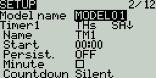
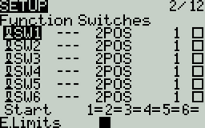
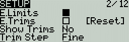
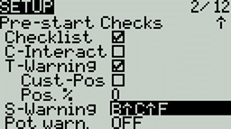
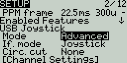
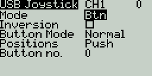
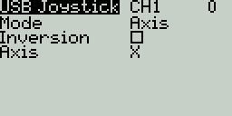
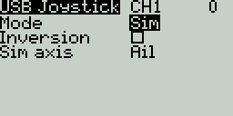

# Setup

<figure><figcaption></figcaption></figure>

The **Setup** screen is where you start to configure your model. It contains the following settings:

**Name** - Name of the model. The maximum number of characters is 10.

* To edit the text, using the **\[roller]** or **\[dial]**, press the button, scroll to select the desired letter, then press the button again to move to the next space. To toggle between lower and upper case, long-press the button. Press the **\[RTN]** button to exit out of text editing mode.

**Image** - Image displayed on the main view (only for radios with 212 x 64 displays).


Image dimensions shall be 64 x 32 pixels, 16 bit, grayscale, .bmp file. The image must be stored in the **IMAGES** folder of the SD card.


### **Timers**

**Timer 1/2/3** - There are 3 configurable timers in EdgeTX. The following configuration options will be displayed once the timer is no longer set to **OFF**:

#### Timer 1   \[Mode]   \[Switch]&#x20;

**\[Mode] -** The options include:

* **OFF** - The timer is not used
* **ON** - The timer runs all the time
* **Strt (Start)** - The timer starts once the configured switch is activated. After the time is started, the timer ignores the switch position.
* **THs (Throttle)** - The timer starts once the throttle is raised and the configured switch is activated. The timer will stop counting if either the throttle position is lowered back to the minimum value or the configured switch is deactivated.
* **TH% (Throttle %)** - The timer counts proportionally to the throttle. It counts in real-time at full throttle and half speed at 50% throttle.
* **THt (Throttle Start)** - The timer starts once the throttle is raised and the configured switch is activated. After starting, the timer ignores the throttle position and will keep counting unless the switch is deactivated.

**\[Switch]** - Select the switch that will trigger the timer to start.  If no switch is selected, the timer will trigger based only on the configured mode. In addition to a switch, you can also select a trim, a telemetry source (triggered when telemetry data is received from that source), or physical activity (stick movement or button press) (labeled as **ACT**)


Those items with a "!" mark in front of the trigger name mean that the condition is reversed. For example, "!SA-" means "when SA switch is not in middle/center position (= up or down)".


**Name -** Name of the timer

**Start -** The time used for the timer's advanced functions.  The default value is 00:00 and when left as such, the timer operates like a stopwatch, counting upward until stopped.  If a different time is entered in this box, then the additional field will appear next to the time with the options: **Remain** or **Elaps**.

If set to **Remain**, the counter will function like a countdown timer - counting down from the designated time to zero and then alerting the user.  If set to **Elaps**, the timer functions like an alarm, counting up from zero until the designated time and then alerting the user.

**Persist. (Persistence):**

* **OFF** - The timer value is reset when switching models or when the radio is turned off / on.
* **Flight** - The timer value is NOT reset when switching models or when the radio is turned off / on. The timer value is only reset when the **Reset flight** option is selected in the [Reset](../main-view/reset.md) menu.
* **Manual Reset** - The timer value is reset only when it is individually selected to be reset (example: Reset timer1) in the [Reset](../main-view/reset.md) menu.

**Minute (Minute Call)** - If selected, you will be notified every minute that passes as described in the **Countdown** option.

**Count Down:**

* **Silent** - No notification is given until the timer reaches zero. When it reaches zero, you will hear one beep.
* **Beeps** - The radio will beep every second starting at the time designated.
* **Voice** - The radio will count down by second starting at the time designated.
* **Haptic** - The radio will vibrate every second starting at the time designated.

<figure><figcaption>
Function Switches
</figcaption></figure>

### **Function Switches**&#x20;

The functions switches are a type of multiposition switch (on select transmitters) that are managed directly by EdgeTX. Physically, they look like a regular 6-pos switch but are much more flexible.

Unlike other switches managed at the radio level, function switches are defined per model and configured in the model setup page. They contain the following configuration options:

**Switch Type**

* **None**: the switch is disabled
* **Toggle**: they are active only during the push duration
* **2POS**: pushing the switch will alternate the state between OFF and On

**Switch group**

A traditional 6POS is a group of 6 switches that work together, where only one can be active at a time. Function switches expand that concept and let you choose how the switches should be grouped.

'**-**' defines a function switch with no group. Pushing it will only affect this switch.

**'1', '2' or '3'** define groups. All the switches in a group act together, **where only one (the last pushed) can be active.**

**Always on groups**&#x20;

Selecting this check box makes the assigned group act like a traditional 6-position switch where one button from the group must be on at all times.

**Startup Position**

**Start** - Defines the state that each switch will be in when the model is loaded.

* **↑** Switch is inactive
* **↓** Switch is active
* **=** Switch is set to the same state it was in when the model was last used (it keeps old state).


Unlike hardware 6-POS implementation (Horus, TX16S,...), software managed switches can not be used as an analog source, they are individual switches with either ↑ or ↓ position. The behavior of previous 6P source can be achieved using a combination of mixer lines


<figure><figcaption>
Trims settings
</figcaption></figure>

### **Trims**

**E.Limits (Extended Limits)** **-** When enabled, it increases the minimum and maximum range for the output values to -150 and 150. Extended limits are necessary if the full range of the control surface cannot be reached with standard limits.

**E. Trims) Extended Trims -** Increases the maximum trim adjustment value from **±**25% to **±**100%.

**Reset** - This resets all trim values to zero.

**Show trims -** When set to **Yes**, it will display the numerical trim value on the trim bar.  When set to **CHANGE**, it will display the numerical value once the trim is no longer at zero.

**Trim Step: -** Defines the amount of increase/decrease in trim when the trim switch is pressed.&#x20;

* Course = 1.6%
* Medium = 0.8%
* Fine = 0.4%
* Extra Fine = 0.2%
* Exponential = 0.2% near the center and the step value increases exponentially as the distance from the center increases.

<figure><figcaption>
Throttle Settings
</figcaption></figure>

### **Throttle**

The throttle related configuration options below are displayed in collapsible menu.

**T-Reverse** - When enabled, this option reverses the output direction of the configured throttle channel.

**T-Source** - The source that will be used for the throttle.&#x20;

**T-Trim-Idle** - When enabled, the throttle trim will only affect the bottom portion of the throttle band.&#x20;


For example, with **Trim idle only** enabled, the throttle stick at the lowest point might have a value of -80 and the center point will still be 0 and the highest point of 100. Without this enabled, the throttle stick at the lowest point might have a value of -80 however, the center point will be 20 and the highest point of 100.&#x20;


**T-Trim-SW** - The trim switch that will be used to trim the throttle. It is possible to substitute the throttle trim switch with the aileron, rudder, or elevator trim switches.


On surface radios (EX: MT-12), the throttle trim has no effect on the reverse throttle range and has some effect over the entire forward throttle range.


<figure><figcaption>
Pre-start Checks options
</figcaption></figure>

### Pre-start Checks

Whenever a new model is loaded, EdgeTX will conduct pre-flight checks based on the checks that are configured on this page. If any of the checks are failed, EdgeTX will give the user an audio and visual warning that must be acknowledged before using the model. The following preflight checks below are displayed in collapsible menu.

**Checklist** - When this option is selected, the model notes file will be displayed when the model is loaded. A valid model notes file must be in the **Models** folder on the SD card. The model notes file must be a .txt file and must have the EXACT same name as the model it is for, for example: Mobula6.txt. The text in the file is up to the user.

**C-Interact** (Interactive checklist) - This option is used with the **Checklist** option. When this option is selected, any line of text in the checklist file that begins with **=** will display as a check box when the checklist is displayed. All displayed checkboxes must be **checked** by selecting them in order to close the checklist.

**T-Warning** - When selected, the radio will check that the throttle is at the minimum value for the configured throttle source in the **T-Source** configuration option.

**Cust-Pos** - When this option is selected, the value designated in **Pos. %** will be used for the **T.Warning**.

**Pos. %** - minimum value of the throttle for the throttle warning when **Cust-Pos** is enabled.

**S-Warning** - The section displays all the switches that are configured on the radio and allows you to select which position is the correct position for the switch state check. Selecting the switch will cycle through the available switch positions or turn the check off for the switch completely.

**Pot warn.** - When activated, this option checks the position of the pots & sliders. There are three options - **OFF**, **ON** and **Auto**. When **ON** or **AUTO** is selected, buttons for the available pots and sliders will appear. To enable the pot warning for an individual pot, select the pot with the **\[roller]** or **\[dial]** and click the button to highlight it. Highlighted pots are enabled.

* **OFF** - Pot and slider positions are not checked.
* **ON** - Positions are checked against manually configured pot and slider positions. To set the check position, select the item that you want to set, and long-press the **\[Enter]** button to set its current position for the check.
* **Auto** - Positions are checked for pots and sliders and compared to the last automatically saved position before the radio was turned off or the model was changed.

**Ctr Beep** - Allows you to turn on/off the center beep function for the individual sticks, pots, and sliders by highlighting them with the **\[roller]** or **\[dial]** and pressing the button. When a switch is highlighted, the function is enabled.

**Glob. Funcs** - When enabled, global functions programmed in the radio settings will apply to this model. When disabled, global functions will not apply to this model.

**ADC filter** - Enables/disables the ADC filter for this model. The **Global** option will take the value designated in the radio settings, which is _on_ by default.


The ADC filter is a filter for the proportional channels (sticks, pots, sliders), smoothing out smaller fast movements that occur due to noise in the system electronics. Normally, this filter should be _disabled_ for models with flight controllers.


#### Internal / External RF

The configuration settings for both the Internal and External RF sections work the same. The only difference is that the **Internal RF** section is for configuring the built-in module and the **External RF** section is for configuring an RF module in the external module bay.

The configuration options are: **OFF** or the _**module name**_ of the installed module as configured in the radio settings. Configuration options are unique to each installed module. Please consult the manufacturer's documentation for configuration options.


Configuration options for the multi-protocol module are described here:  [https://www.multi-module.org/using-the-module/protocol-options](https://www.multi-module.org/using-the-module/protocol-options)


**Receiver number** - A receiver number is a user-assigned number for a model that is sent to the receiver when bound. Each model must have a unique receiver number. However, models using different protocols may have the same receiver number without issues. EdgeTX will inform you when a receiver number is unique or if it is already being used with a text above the number field.


If using the radio in gamepad mode, both internal and external RF modules should be turned off. This will result in increased performance when connected to a computer via USB.&#x20;


### **Trainer**

**Trainer Mode** - The **Trainer Mode** option is where you can configure the CPPM passthrough mode and method. When enabled, this allows the CPPM signals from a radio in _**Slave**_ mode to be passed through to another radio in Master mode which will then pass the signal to the model it is connected to. CPPM passthrough can be used for several different use cases, such as: connecting a head tracker, Instructor / Student training mode, and controlling complex models that require more stick inputs than available on a standard transmitter.

**Master mode** - This is the mode for the radio that will be connected to the model. This radio also shall configure the special/global function (Trainer) to activate the passthrough mode. When the passthrough mode is activated, the CPPM signals from the radio in _**Slave mode**_ will be sent to the model for control.

**Slave mode** - This is the mode for the radio that will pass it's CPPM values to the radio in _**Master mode,**_ which are then sent to the model.

Below are the possibile configuration options:

* **OFF** - Trainer mode is not used for this model.
* **Master/Jack** - Master mode using a cable connection.
* **Slave/Jack** - Slave mode using a cable connection.
  * **Ch. Range** - This is the range of channels that will be sent to the radio in Master mode. Channel 10 is the recommended last channel to use.
  * **PPM frame** - The first field is the length of the PPM frame. The second field is the stop length/delay between pulses. The dropdown is to select the polarity of the signal. The frame length is automatically adjusted to the correct value when the number of transmitted channels is changed. However, this automatically assigned value can be manual changed. _**Note**: In most cases, the default setting does_ not _need to be changed._
* **Master / Bluetooth** - Master mode using a Bluetooth connection (if installed in radio).
* **Slave / Bluetooth** - Slave mode using a Bluetooth connection (if installed in radio).
* **Master / Multi** - Master mode using an additional externally mounted Multi-protocol module for the connection. For more information on this setup, see [set-up-wireless-trainer-with-mpm.md](../../edgetx-how-to/set-up-wireless-trainer-with-mpm.md "mention")

<figure><figcaption>
Enabled Features options
</figcaption></figure>

### Enabled Features

The **Enabled Features** section allows you to configure which pages are visible in the selected model's radio setup and model settings area of EdgeTX. The page names are displayed in a collapsible menu with the following configurable options:

* **Global** - When selected, the tab will take the global value configured in the **Enabled Features** area in **Radio Setup**. The configured global value will display next to the option.
* **On** - When selected, this tab will be visible when this model is loaded.
* **Off** -  When selected, this tab will not be visible when this model is loaded.


_**Note:**_ Turning off a tab only hides the tab and does not change the items already configured in that tab.

**EXCEPTION:** Turning off the Global / Special Functions tab will disable configured global / special functions for that model.


<figure><figcaption>
USB Joystick advanced mode settings
</figcaption></figure>

### USB Joystick

The **USB Joystick** has two possible modes, **Classic** and **Advanced**.&#x20;


If using the radio as a USB Joysitck, both internal and external RF modules should be turned off. When configured as such, the mixer will run at 1000Hz when in Joystick mode (which is needed for F.Sim competitors). Additinally, it also displays mixer run time in statistic/debug screen. This will result in increased performance when connected to a computer via USB.&#x20;


In **Classic mode**, the radio's configured output channels will be sent to the target device in numerical order and mapped to the device's preconfigured USB controller axes and buttons. Below is the default channel mapping for Microsoft Windows.

* Ch 1 - X Axis
* Ch 2 - Y Axis
* Ch 3 - Z Axis
* Ch 4 - X Rotation
* Ch 5 - Y Rotation
* Ch 6 - Z Rotation
* Ch 7 - Dial
* Ch 8 - Slider
* CH 9 - Ch 32 - Buttons 1 - 24

In **Advanced mode** you can configure the following additional options:

**If. mode (Interface mode):** This indicates to the target device (the device you are connecting your transmitter to) what type of device you are connecting. The options are **Joystick**, **Gamepad**, **MultiAxis.** &#x20;


**Note:** Currently there is a limitation in MS Windows that may limit your transmitter to being only detected as a Joystick, regardless of what is selected in this option. In MacOS, Linux and Andriod this functions properly.


**Circ. cut (Circular cutout)** - For axis pairs (X-Y, Z-rX): By default, the range of the axis pairs is a rectangular area. With this option, the axis will be limited to a circular area (like gamepad controllers commonly are). Options are : **None** or **X-Y, Z-rX** or **X-Y, rX-rY** or **X-Y, Z-rZ**

**Channel Settings**

**Mode** - For each output channel, you can select the mode that you want to use for that channel. The available options are **None**, **Btn**, **Axis**, **Sim**.

* **None** - Channel is not used

<figure><figcaption>
Button mode options for a selected channel
</figcaption></figure>

* **Btn** - Channel is used to simulate a button. Configuration options include:
  * **Inversion** - Inverts the output channel signal. Options are: **On** / **Off**
  * **Button Mode** -
    * **Normal** - Each postion of a multiposition switch is represented by a button. The current switch state is represented by a continous button press.
      * **Pulse** - Similar to "Normal" mode. However, instead of continous button press it is represented by a short button press.
      * **SWEmu** - The toggle switch emulations a push button. The first press turns the virtual button on, the second press turns it off.
      * **Delta** - The change of the output channel is represented by 2 buttons. While the output value is decreasing, the first button is pressed. When the output value is increasing, the second button is pressed. If there is no change, then no buttons will be pressed.
      * **Companion** - This option should be selected when using your transmitter to control the simulator in EdgeTX Companion.  It allows the multi-position switches to function properly in the simulator.
  * **Positions** - The type of button that will be simulated.&#x20;
    * **Push -** will only map to one button
      * **2POS - 8 POS** - will map to the number of buttons that the switch has (ex: 3POS will map to 3 buttons).
  * **Button No:** The button number that the output will be mapped to and sent to the target device as.

<figure><figcaption>
Axis mode options for a selected channel
</figcaption></figure>

* **Axis** - The channel is used to simulate an axis and will be mapped to one of the target device's default axes.
  * Axis options are: **X**, **Y**, **Z**, **rotX** (rotation X), **rotY**, **rotZ**

<figure><figcaption>
Sim mode options for selected channel
</figcaption></figure>

* **Sim** - The channel is used to simulate a common sim axis and it will be listed on the target device as the selected option (ex: Thr)
  * Sim Axis options are: **Ail**, **Ele**, **Rud**, **Thr, Acc**, **Brk**, **Steer**, **Dpad**

Pressing the **\[PAGE>]** button will take you to the **Heli Setup** screen.
