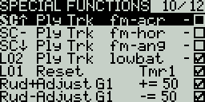

# Special Functions

The **Special Functions** section is where you can configure the special functions that are included in EdgeTX. These special functions add additional functionality beyond normal model controls, such as enabling trainer mode, playing a sound, adjusting the radio backlight, adjusting radio volume, etc. On the special functions screen, you will see all configured special functions as well as some of the configured options such as function name, activation switch, if the function is enabled, and other configuration options.

<figure><figcaption>
Special Functions
</figcaption></figure>

### Configuring Special Functions

To configure a special function, select the desired special function row and press the **\[Enter]** button. Then, scroll with the **\[Roller]** to select the attribute that you want to edit (it will be highlighted) and press the **\[Enter]** button to edit it (it will now be blinking). Edit the option by scrolling with the **\[Roller]** and pressing the **\[Enter]** button to select the desired option. Once all the options are configured, press the **\[Return]** button to exit out of editing mode for the special function.

All special functions have the configuration options below. Additional options may be added based on the selected function. See the **Functions** section below for these additional options.

* **Trigger** - The switch or trigger that will make the special function active. Long pressing on this section will allow you to quickly select the category of the switch and filter the results. You can select the following filters: _**Switches**_, _**Trims**_, _**Logical Switches**,_ _**Other**_ and _**Invert**_
* **Function** - The function that will be used. See below for function descriptions.
* **Enable** - Toggle on/off to enable the function. To be able to activate the special function by a switch, it must be enabled. This option is usually the last option listed as a checkbox on the far right of the screen. Disabled special functions will not function regardless of the configured switch position.

### Functions

Below are all the available functions in EdgeTX, what they do, as well as what additional configuration options that will be shown when the function is selected.

**Override** (Channel Override) - Overrides the defined channel with the defined value.

* **CH** - Channel to be overridden
* **Value** - Value to replace the normal channel value. (Range -100 to +100)

**Trainer -** Enables trainer mode.

* **Value** - Specifies which controls will be given over to the student. Options include **Sticks** (all sticks), **Rud** (Rudder), **Ele** (Elevator), **Thr** (Throttle), **Ail** (Aileron), and **Chans** (all channels).&#x20;

**Inst. Trim** (Instant Trim)- Sets all trims to the current values of their respective sticks.

**Reset** (Reset Timer)- Resets the timer or telemetry specified in the value back to their initial values.

* **Reset** - Options are **Tmr 1, Tmr 2, Tmr 3, All,** and **Telemetry.** See [**Reset Telemetry**](../main-view/reset.md) for more information on what data is reset for each option.

**Set** (Set Timer) - Sets the specified timer to the specified value.

* **Timer** - Options are **Tmr 1, Tmr 2, Tmr 3**
* **Value** - The range is 00:00:00 to 08:59:59&#x20;

**Adjust** (Adjust Global Variable) - Changes the value of the specified global variable.

* **Global var** - Select the global variable that you want to adjust.
* **Mode** - Select the mode to change the global variable. Options are: **Constant, Mixer Source, Global var, Inc/Decrement.** Long-press the **\[Enter]** button to select the mode.
  * **Constant** - Sets the specified global variable to the defined constant value.
  * **Mixer Source** - Sets the specified global variable to the defined mixer source value.
  * **Global Var** - Sets the specified global variable to the defined global variable value.
  * **Inc/Decrement** - Increments/decrements the specified global variable by the specified amount.

**Volume** - Changes the radio volume. The change source is specified in the Volume dropdown.

**SetFailsafe** - Sets the custom failsafe values for the selected module (Internal/External) to the current stick position when activated. For this option to work, the Failsafe mode for the RF module must be set to **custom**.

**Play Sound** - Plays the sound selected in the value field when activated.

* **Value** - Sound to play. Possible values are **Beep1/2/3, Warn1/2, Cheep, Ratata, Tick, Siren, Ring, SciFi, Robot, Chirp, Tada, Crickt, AlmClk**. _Note: SD card sound pack is not required._
* **Repeat** - Frequency to repeat the sound. Options are **!1x** (do not play at startup even if the switch is active), **1x** (play once), **1s** thru **60s** (play every xx seconds).

**Play Track** - Plays the .wav sound file selected in the value field when activated.

* **Value** - .wav sound file to play from the SD card.
* **Repeat** - Frequency to repeat the track. Options are **!1x** (do not play at startup even if the switch is active),  **1x** (play once), **1s** thru **60s** (play every xx seconds).

**Play Val -** Announces the value of the selected element in the value field.

* **Value** - The source for the value to announce. It can be an input, stick, pot, slider, trim, physical and logical switch, trainer import channel value, global variable, telemetry sensor or channel.
* **Repeat** - Frequency to repeat the announcement. Options are **!1x** (do not announce at startup even if the switch is active), **1x** (announce once), **1s** thru **60s** (announce every xx seconds).

**Lua Script** - Executes the Lua script defined in the value field. The Lua script must be located in /SCRIPTS/FUNCTIONS/ folder on the SD card. Lua scripts that display information on the screen cannot be executed with this special function.

* **Value** - LUA script file to play from the SD card.
* **Repeat** - Frequency to repeat the Lua script. Options are: **ON** (repeat indefinately as long as switch is active) or **1x** (once)

**BgMusic** - Plays the .wav file selected in the value field on a loop when enabled. The file shall be in the SOUNDS/(language)/ folder on the SD card.

**BgMusic II** - Temporarily pauses the .wav file playback specified in the **BgMusic**

**Vario** - Enables the variometer beeping sound for the ascent and descent of the model.

**Haptic** - Causes the radio to vibrate (haptic feedback) when enabled.

* **Value** - Type of vibration pattern. Options are: 0 - 4.
* **Repeat** - Frequency to repeat the vibration pattern. Options are **!1x** (do not vibrate at startup even if the switch is active), **1x** (vibrate once), **1s** thru **60s** (vibrate every xx seconds).

**SD Logs** - Creates a log .csv file of the radio and telemetry values in the LOGS folder on the SD Card. The radio will create a new entry into the log file based on the frequency configured in the **Value** setting.  The value options are **0.0s** - **25.5s** (Note: 0.0 effectively disables this option). Each time the function is activated, the radio will create a new log file provided that the function is activated at least as long as the value setting. **Note:** Logging will not start if SD card has less than 50mb of free space.&#x20;

**Backlight** - adjusts the screen contrast (LED screens) or OLED brightness (OLED screens) based on the source defined in the value dropdown.

**Screenshot** -  Creates screenshot as a .bmp file in the SCREENSHOT folder on the SD Card.

**RacingMode** - Enables racing mode (low latency) for FrSky Archer RS receivers. Racing mode must also be enabled in External RF Module Settings.

**Audio Amp Off** (select radios) - Disables the Audio Amplifier so that no sound comes from the speaker, including annoying feedback or interferance. This option is only available on select radios.

**RGB Led** - Executes the selected LED related Lua script on the SD card in the **Scripts** -> **RGBLED** folder.

Pressing the **\[PAGE>]** button will take you to the **Telemetry** screen.
