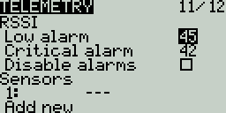

# Telemetry

Telemetry is data received from the model to the radio from various sensors. These sensors may be included in the radio receiver or flight controller or may be separate sensors, such as GPS, variometer, or magnetometer. The received telemerty data can be displayed by EdgeTX in widgets, configured in alarms or audio call-outs.

The Telemetry screen is where you configure these sensors to use in EdgeTX.  Below are the following configuration options:

**Sensors**

<figure><figcaption>
Sensors portion of the Telemetry screen
</figcaption></figure>

All previously configured sensors are listed here. The list is collapsible by clicking on the **arrow icon** to the right side of the **Sensors** label. The number of configured sensors will be displayed in **parentheses,** ex: (6), when the sensor list is collapsed. Sensors that have not received data since the model was loaded or the telemetry values were reset display **---** for the values. The asterisk **\*** to the left of the sensor value will flash when the sensor has received a data update. A solid asterisk**\*** indicates that the sensors that are receiving regular updates. Sensors that are no longer receiving regular updates will not be marked with the asterisk**\***. See [Common Telemetry Sensors](../../../color-radios/model-settings/telemetry/common-telemetry-sensors.md) for a list of commonly used sensors in EdgeTX.

The following options are listed under the sensor list.

* **Discover New:** When selected, it will look for new sensors on the model and automatically configure them. If the sensor list is collapsed when a new sensor is discovered, the newly found sensor will be visible on the sensor list (old sensors will remain collapesd/hidden).
* **Add New:** When selected, it will create a new blank sensor for that must be configured manually.&#x20;
* **Delete All:** This option will delete all previously configured sensors.
* **No inst.** (ignore instances)**:** This option prevents multiple sensors from reporting the same telemetry data.


If no sensors are listed in the sensors section, you may need to select **Discover New** to detect the sensors. Additionally, not all RF protocols transmit telemetry data.


If you long-press the **\[Enter]** button for a specific sensor, the following options will be displayed:&#x20;

* **Edit**: Allows you to edit the sensor's configuration options.
* **Copy**: Creates a copy of that sensor.
* **Delete**: Deletes that sensor.

See the [Sensor Configuration](sensor-configuration-options.md) page for a detailed description of all the configuration options for setting up or editing sensors.

**RX Status**

<figure><figcaption>
RSSI Portion of Telemetry screen
</figcaption></figure>

Here you can configure the threshold for the RX alarms. The Rx-Stats label will change (Rx-Stats, RSSI, Rqly, Sgnl) depending on the protocol that is used with the model.

* **Low alarm** - The threshold value when the "RF signal low" voice prompt will be played. The recommended value is 45.
* **Critical alarm** - The threshold value when the "RF signal critical" voice prompt will be played. The recommended value is 42.
* **Disable telemetry alarms** - When enabled, no alarm voice prompts will be played.

**Variometer**

<figure><figcaption></figcaption></figure>

A variometer detects changes in the model altitude.  EdgeTX can alert the user of these altitude changes by providing a rising/lower pitched tone. Use the **Variometer** menu on the Radio Setup page to set the actual frequency and volume of the tone to be played. The following options exist to configure the variometer alarm.


You will need to use a **Vario** Special or Global Function to enable this functionality!


* **Source** - Specifies the sensor to use as the variometer. It is selected from the telemetry sensors added in **Sensors** section.
* **Range** - Specifies the ascent/descent range that will trigger the change in the Variometer beeping pitch. If climb/descent rate is within the range specified here, beeping pitch will change according to that value. When it goes beyond the range specified here, beeping pitch will stop changing. Units are meters/second or feet/second based on the **Units** setting on the **Radio Setup** page.
* **Center** - Specify the range for ignoring changes in climb/descent rates. When the climb/descent rate is within the range specified here, the beeping pitch will not change.
* **Tone/Silent** - Specifies whether to beep when climb/descent rate is within the range specified by **Center**.

Pressing the **\[PAGE>]** button will take you to the **Display** screen.
