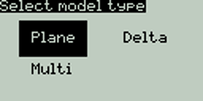
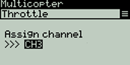

# Radio Settings

### Tools

Pressing the **\[SYS]** button from the Main view will open the **Tools** screen. &#x20;

The **Tools** page in Radio Settings is where you can select Lua script-based tools for execution. Lua scripts that are located on the SD card in the **Tools** folder will be listed here. Selecting a tool will execute it. By default, EdgeTX includes several tools. Other tools can be downloaded and added to the SD card as well.  The following tools are included in the default EdgeTX SD card.&#x20;

### Wizard Loader

<figure><figcaption>
Setup Wizard
</figcaption></figure>

 

<figure><figcaption>
Setup Wizard Configuration menu
</figcaption></figure>

The Wizard Loader tool assists you in setting up a new model by running a setup wizard for a particular model type. Once the model type is selected, the wizard will take you through a series of prompts and then configure your selected model based on the information provided.&#x20;

_**NOTE: The wizard does not create a new model, it only configures the currently selected model. You must manually create a new model first and then run the wizard. If you run this wizard on an already configured model, it will overwrite your model settings!**_


Additional EdgeTX compatible Lua scripts can be downloaded from: [https://github.com/EdgeTX/lua-scripts](https://github.com/EdgeTX/lua-scripts)


Pressing the **\[PAGE>]** button will take you to the **SD Card** screen.
