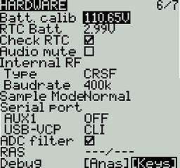

# Hardware

The **Hardware** screen is where you configure hardware specific-settings for your radio. It shows all physical hardware objects (sticks, pots, switches) and allows for their modifications. It is also where you can calibrate your sticks and pots. It also contains additional configuration options.

<figure><figcaption>
Hardware Screen
</figcaption></figure>

### **Calibration**

To calibrate your physical radio controls (sticks, pots, sliders, & 6-position switch), highlight the **\[Calibration]** option and press the **\[Enter]** button. The radio will prompt you through the calibration steps.&#x20;


For your gimbal calibration, use a left-to-right & up-to-down movement for the gimbals, not a circular movement! Additionally, use the normal amount of pressure at the endpoints. Excessive endpoint pressure will cause the gimbal to be miscalibrated. Also, do not forget to calibrate your 6-position switch!


### Inputs, Sticks, Pots, and Switches Buttons List

Selecting one of the Axis, Pots, or Switches lines from the list will allow you to add a 3 character label to the control as well as change the type of control as needed. Additionally, you can invert the direction of the Pots by selecting the **->**

### Additional hardware configuration options

<figure><figcaption>
Hardware Screen
</figcaption></figure>

**Batt. Calib** (Battery Calibration) - Set this value to match the transmitter battery voltage. This ensures that the displayed battery voltage is accurate.

**RTC Batt** - The current voltage of the RTC battery. The RTC (real time clock) battery keeps the radio's date and time accurate even when no main radio battery is present.

**Check RTC** - When enabled, checks the RTC battery at startup and warns you if the battery voltage is low.

**Audio Mute** - When enabled, puts the transmitter in mute mode until a sound needs to be played. This prevents interference noise from high-powered TX modules from coming out of the transmitter speakers.&#x20;

**Internal RF Type** - Select the module type for the internal module bay. Options are: **Multi, XJT, ISRM, CRSF**.  When **CRSF** is selected, you can also select the baud rate. You can read more about baud rates [here](https://www.expresslrs.org/2.0/quick-start/transmitters/tx-prep/).

**Sample Mode** (**External RF)**- Options are **Normal** and **OneBit**. The default setting of **Normal** should be used by most users. Only users of  X9D+ and X7 radios may want to use **OneBit** mode.


The X9D+ and X7 radios have a slow inverter that causes problems with the reception of fast UART signals, resulting in telemetry warnings and issues with LUA scripts using the CRSF protocol. A 10k resistor on the circuit board could be replaced to fix the issue, but this was not always effective. EdgeTX has developed OneBit Mode, which changes the UART sampling behavior to ignore slow leading edges, allowing the CRSF protocol to be run at the full 400k baud rate without hardware modifications to the radio.


#### **Bluetooth**


_**Note:** This option is only visible on custom compiled versions of EdgeTX with the **Bluetooth** flag enabled._


**Mode - mode that the bluetooth module will be used in. The options are:**

* **---** - Off
* **Telemetry** - used for sending telemtry data over bluetooth.
* **Trainer** - used for bluetooth trainer mode

One a mode is selected, you will see the following information:

* **PIN Code** - PIN code for bluetooth device in the radio (visible in **Telemetry** mode only)
* **Local addr -** Identifying address of the bluetooth device in the radio.
* **Dist addr -** Identifying address of bluetooth device that radio is connected to.

**Name -** the name the bluetooth device will be seen as.

**Serial Port** - Displays a list of available auxiliary serial ports that can be configured and used. The listed ports are based on the ports that are available in the particular radio hardware. The ports listed below are for example only and may not be present in your radio.

*   **AUX1** - First available auxiliary serial port can be configured with the below options:

    * **OFF** - Turned off.
    * **Telem Mirror** - The same telemetry data that goes to the external module bay is sent to the serial port.&#x20;
    * **Telemetry In** - Receive telemetry data over the serial port.
    * **SBUS Trainer** - Connect the Instructor and Student radios over the serial port.
    * **LUA** - Send/receive data to/from Lua script.
    * **GPS** - Receive GPS telemetry data over the serial port.
    * **CLI** - Send commands to the radio via the command line.&#x20;

* **USB-VCP** - Virtual COM Port. This is one of the options presented when connecting your radio to the PC with most radios. Is often set to 'CLI' for radios with internal ExpressLRS RF modules in order to do firmware updates.

**ADC Filter** - Enables or disables the ADC Filter. This filter can also be enabled/disabled per model in the model settings.


The ADC filter is a filter for the proportional channels (sticks, pots, sliders), smoothing out smaller fast movements that occur due to noise in the system electronics. Normally, this filter should be _disabled_ for models with flight controllers.&#x20;


**RAS** - (Formerly SWR) Reflected antenna signal. Lower numbers are better, with a 1:1 ratio being theoretically the best. Not supported by all RF Protocols.

### Debug

The debug section allows for testing and debugging of the analog controls and keys.

<figure><figcaption>
Debug Analogs screen
</figcaption></figure>

 

<figure><figcaption>
Debug Keys screen
</figcaption></figure>

**Debug Analogs**  - These screens will show you the data for your analog controls (Sticks, Sliders, Pots, 6-position switch). There are two views - Calibrated Analogs, Raw Analogs (5 Hz).

**Debug Keys** - This screen will show you the digital data for your keys, switches, trims, and the rotary encoder (roller).

Pressing the **\[PAGE>]** button will take you to the **Version** screen.
