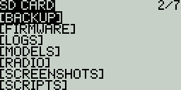

# SD Card

<figure><figcaption>
SD Card Screen
</figcaption></figure>

The **SD Card** screen shows you the contents of your SD card, allows you to navigate the folders and interact with the files in the folders. All folders contain a README.txt file that describes what type of files belong in this folder. After selecting a file in one of the folders, you will be presented with some of the options below, depending on the file type that was selected:

* **Assign bitmap** - Assigns the selected image file as the model image of the currently selected model.
* **Copy** - Copies the selected file.
* **Delete** - Deletes the selected file.
* **Execute** - Executes a Lua script. Used for files ending in **.lua**
* **Flash \[target]**- Flashes the selected firmware file to the select target module.  Examples: Flash Bootloader, Flast Internal Multi.
* **Paste** - Pastes the copied file.
* **Play** - Plays the selected sound file.
* **Rename** - Renames the file.
* **View text** - Views the selected **.txt**, **.csv**, and **.lua** files.&#x20;

The folders listed on the SD card screen are the same as what you will see when connecting your radio to your computer. Below are the folder names and explanations for all the folders that come with the default EdgeTX SD Card.&#x20;

### BACKUP

The backup folder contains model files for models that were backed up from the EEPROM. This folder will only be present on radios that store the model files in EEPROM.

### FIRMWARE

Place the firmware files that you want to flash in this folder. This folder is empty by default (except for the readme.txt file). When selecting a .bin file you will be given the option to flash the firmware to a particular module. Also, only firmware files in this location will be visible from the bootloader menu.

### IMAGES

_NOTE: This folder is only used for radios with 212x64 displays._&#x20;

Place your custom model image files in this folder. This folder is empty by default (except for the readme.txt file). Selecting an image file will give you the option to **Assign Bitmap**, which assigns the selected image file as the model image of the currently selected model.

The ideal image size for _model images_ is 64x32 pixels. The picture format should be .bmp The image file name should not exceed 9 characters and the image formatting should be 4 bit indexed colored mode.


[https://www.skyraccoon.com/](https://www.skyraccoon.com/) has a large repository of free image files that can be used with EdgeTX.


### LOGS

This is where the log files that are configured in the [special function](../model-select/special-functions.md) **SD Logs** are written. These files can be viewed with the **View text** option. This folder is empty by default (except for the readme.txt file).

### MODELS

This is where the model files, label information, and preflight checklists are stored.  Each model will have a **model\[#].yml** file that contains all configured options.&#x20;

Models that are deleted via the radio will be moved to the **DELETED** folder that is included in this folder. The remaining model files are what will be visible on the **Model Select** screen.

If you have configured the **Display checklist** option in model settings, the model notes file goes in this folder. The model notes file must be a .txt file and must have the EXACT same name as the model it is for, for example: Mobula6.txt. The text in the file is up to the user.

### RADIO

This folder contains the **radio.yml** file. This file contains all the radio configuration data. If this file is corrupted or missing, the radio will go into **Emergency Mode** and will create a new radio.yml file with the default settings.&#x20;


If the radio.yml file is manually edited, the **manuallyEdited:** tag must be set to **1** in the radio.yml file or the radio will think it is corrupted, go into **Emergency Mode** and will create a new radio.yml file with the default settings. The original .yml file will be saved in the folder.


### SCREENSHOTS

This is where the screenshot image files that are configured in the [special function](../model-select/special-functions.md) **Screenshot** are written. This folder is empty by default (except for the readme.txt file).

### SCRIPTS

This folder and its subfolders are where the Lua scripts get placed. It contains the following sub-folders by default. You can download additional Lua scripts from [https://github.com/EdgeTX/lua-scripts](https://github.com/EdgeTX/lua-scripts).

* **Functions** - This folder is where the functions Lua scripts that can be activated by the [special function](../../color-radios/model-settings/special-functions.md) **Lua Script** must be placed. This folder is empty by default (except for the readme.txt file).  More information about function Lua scripts can be found here: [Function Scripts](https://luadoc.edgetx.org/part\_i\_-\_script\_type\_overview/function\_scripts).
* **Mixes** - This folder is where the Lua mixer scripts shall be placed. This folder is empty by default (except for the readme.txt file). More information about Mixer Lua scripts can be found here: [Custom Mixer Scripts](https://luadoc.edgetx.org/part\_i\_-\_script\_type\_overview/mix)
* **RGBLED** - This folder is where Lua scripts that control the RGB Leds (if hardware available) are stored.
* **Tools** - Contains the Lua scripts that are available in the [Tools](../../color-radios/radio-settings/tools.md) screen.&#x20;
* **Wizards** - Contains the Wizard Lua scripts that are available in the [Tools](../../color-radios/radio-settings/tools.md) screen.&#x20;

### SOUNDS

This folder is where the EdgeTX sound packs for your radio get placed. The sound packs are language-specific and correlate to the **Voice language** option in **Radio Setup**. Selecting a sound file from this folder will give you the option **Play**, which plays the selected sound file.

Sound packs are available for manual download at: [https://github.com/EdgeTX/edgetx-sdcard-sounds/releases](https://github.com/EdgeTX/edgetx-sdcard-sounds/releases).  It is also possible to create custom sounds to use in EdgeTX. For your custom sounds to be playable by EdgeTX ensure that they meet the following criteria:

* File Name: 123456.wav (up to 6 characters plus .wav)
* Sample Rate: 32 kHz (or 16 Khz, 8Khz)
* Bits / Sample: 16 (or 8)
* Tracks: 1, mono
* Compression Codec: PCM


For a demonstration video of how to make your own custom sounds that will work with EdgeTX, check out: [https://www.youtube.com/watch?v=DqF7HUsFrnE](https://www.youtube.com/watch?v=DqF7HUsFrnE)


Pressing the **\[PAGE>]** button will take you to the **Radio Setup** screen.
