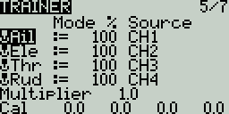

# Trainer

The **Trainer** screen in Radio Settings is used to configure how the radio in Master mode will handle the signals from the radio in Slave mode. It contains the below configuration options.&#x20;

<figure><figcaption>
Trainer Ccreen in Radio Settings
</figcaption></figure>

For each of the four main control inputs (Ail, Ele, Thr, Rud), the following options can be configured (for each row, from left to right).

**Mode -**  How the radio in Master mode will handle the signals from the radio in Slave mode.&#x20;

* **OFF** - Stick values from the radio in Master mode will be used - no input from the radio in Slave mode.
* **+=** Adds the stick values from both the radios in Master and Slave modes.
* **:=** Replaces the stick values from the radio in Master mode with the stick values from the radio in Slave mode. (Default)
* **Weight** - Percentage of stick travel to use of the radio in Slave mode. Use negative values to change the stick direction.
* **Source channel** - The channel from the radio in Slave mode that is mapped the control input.

**Multiplier** - This value changes the weight of all the sticks together.&#x20;

**Cal (calibrate)**- Sets the center stick value of the radio in Slave mode.


The trim from the radio in Master mode is usually used. Set the trims on the radio in Slave mode to their center.



The radio in Master mode is the one that gets bound to the model receiver.



A virtual trainer switch (**Tnr**) can be selected as switch to activate a special function or curve. The switch is ON when the trainer link is active.


Pressing the **\[PAGE>]** button will take you to the **Hardware** screen.
