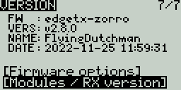

# Version

### Version

The **Version** screen displays information about the current EdgeTX version that is being used:

<figure><figcaption>
Version Screen
</figcaption></figure>

* **FW** - Firmware name
* **VERS** - Firmware version
* **NAME**: Firmware Codename
* **DATE** - Date & time the firmware was compiled

### Firmware Options&#x20;

To view the build options that were enabled when compiled, highlight the **\[Firmware options]** options and press the **\[Enter]** button.

<figure><figcaption>
Firmware Options Screen
</figcaption></figure>


A complete list of build options can be found here: [https://github.com/EdgeTX/edgetx/wiki/Compilation-options](https://github.com/EdgeTX/edgetx/wiki/Compilation-options)


### **Modules / RX Version**

To view the Modules / RX Version information about the activated RX modules for the currently selected model, highlight the **\[Modules / RX Version]** option and press the **\[Enter]** button.

<figure><figcaption>
Modules / RX Version Screen
</figcaption></figure>
