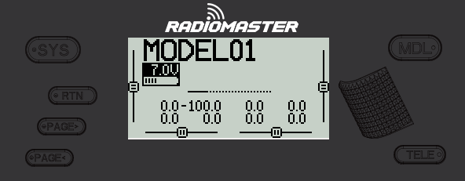

# User Inteface

<figure><figcaption>
Common buttons user for radio menu navigation 
</figcaption></figure>

The buttons below are commonly used to navigate EdgeTX. If your radio does not have these buttons, please consult the [manufacturer's documentation](https://drive.google.com/drive/folders/1HPqNbVZT9yzQsHoVKRPTM1YFeBXevYS9?usp=sharing) to see your radio's specific button configuration.

### **Buttons:**

* **\[SYS]** - System Button\
  \- Short press **\[SYS]** button from the main screen to go to the [Tools](radio-settings/) page of the Radio Settings menu.
* **\[MDL]** - Model Button\
  \- Short press **\[MDL]** button from the main screen to go to the [Model Select ](model-select/)page of the Models menu
* **\[RTN] -** Return / Back \
  \- Short press **\[RTN]** button to return to the previous page, previous menu or cancel action
* **\[PAGE>] / \[PAGE<]** - Page next & page previous\
  \- Used to navigate between different screens, tabs, or options settings, depending on the screen.
* **\[TELE] -** Telemetry \
  \- Press the **\[TELE]** button to go to the configured telemetry screens. More information about the telemetry screens is found in the [Display ](model-select/display.md)section.
* **\[Roller]** or **\[Dial]** - Next & previous value\
  The roller is used to navigate through menu options. &#x20;
* **\[Enter]** - Accept \
  \- Used to select option, function or accept value\
  \- Push **\[Roller]** or **\[Dial]** button to select or enter.
