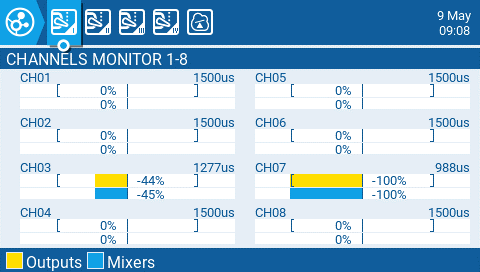
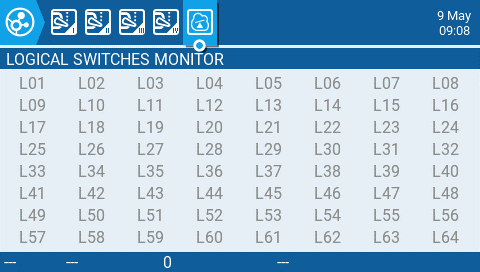

# Channel Monitor

The Channel Monitor shows both the output value (top bar) and mix value (bottom bar) for each of the 32 radio channels, spread across 4 pages of 8. &#x20;

<figure><figcaption>
Channels Monitor
</figcaption></figure>

The 5th page of the channel monitor is the logical switches monitor. On this page, you will see the status (activated/non-activated) of all logical switches. Logical switches that are activated are highlighted.&#x20;

<figure><figcaption>
Logical Switches Monitor
</figcaption></figure>
