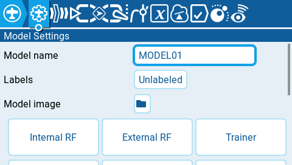

---
metaLinks:
  alternates:
    - https://app.gitbook.com/s/2n2y0XsJcrhXt3asceP0/color-radios/model-settings
---

# Model Settings

<figure><figcaption>
Top of the Model Settings section
</figcaption></figure>

The **Model Settings** screen contains all the options to configure your model. Across the top of the page you will see icons that will take you to different pages of model settings when selected. The default screen for model settings is the[model-setup](model-setup/ "mention") screen.&#x20;

The icons at the top of the screen include (in order from left to right):

* [Model Setup](model-setup/)
* [Flight modes](flight-modes.md)
* [Inputs](inputs-mixes-and-outputs/inputs.md)
* [Mixes](inputs-mixes-and-outputs/mixes.md)
* [Outputs](inputs-mixes-and-outputs/outputs.md)
* [Curves](curves.md)
* [Global Variables](global-variables.md)
* [Logical Switches](logical-switches.md)
* [Special Functions](special-functions.md)
* [Custom Scripts](custom-scripts.md)
* [Telemetry](telemetry/)


If an tab/icon is missing, it may have been disabled either at the [model setup](model-setup/enabled-features.md) or [radio setup](../radio-settings/radio-settings/additional-radio-settings.md#enabled-features) level.



If you are looking for the Heli Tab, it moved in v2.12 to be a button at the bottom of the Model Setup page (when the Heli feature is enabled).

