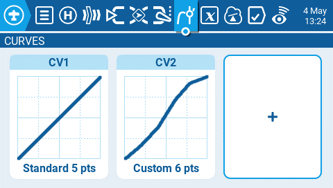
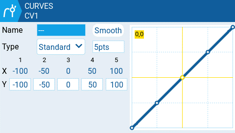

# Curves

The **Curves** screen of Model Settings allows you to define custom curves to use in the Inputs, Mixes, or Output screens. The curves screen will show all of the configured custom curves, with a graphical representation of each curve, the number of points, and the curve type. &#x20;

<figure><figcaption>
Curves screen
</figcaption></figure>

Selecting an existing custom curve will display the following options:

* **Edit** - Opens the curve configuration page.
* **Preset** - Allows you to set the curve to one of the preset slope values (-45 to 45 degrees in 15 degree increments). The curve will have 5 points and smoothing is not enabled by default.
* **Mirror** - Mirrors the selected curve.
* **Clear** - Clears all curve values from the selected curve.

Selecting the plus button to create a new curve will give you the following options:

* **Edit** - Opens the curve configuration page.
* **Preset** - Allows you to set the curve to one of the preset slope values (-45 to 45 degrees in 15 degree increments). The curve will have 5 points and smoothing is not enabled by default.

<figure><figcaption>
Curve configuration screen
</figcaption></figure>

Selecting **Edit** for a configured or unconfigured curve will open the curve configuration screen and display the following options:

* **Name** - Name for the curve. Only 3 characters are possible.
* **Type** - Type of curve: Options are **Standard** and **Custom**
  * **Standard** - Horizontal axis points are fixed values based on the number of points. Vertical axis points are adjustable.
  * **Custom** - Both horizontal and vertical axes are adjustable.
* **Number of Points** - number of points in the curve
* **Smooth** - When enabled, connects the points with curved lines instead of straight lines
* **Verticle point values** - Adjust the point values to make the desired curve.


The stick positions are displayed in yellow on the curve. Moving the control sticks will update the stick position on the curve in real time.

