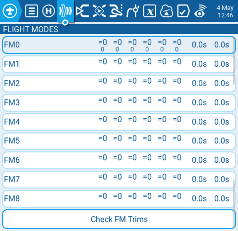
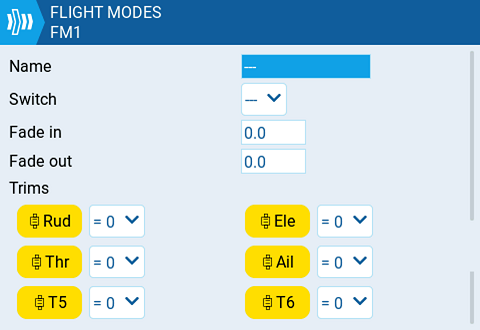

# Flight Modes

<figure><figcaption>
Flight Modes page
</figcaption></figure>

Flight modes allow you to have different trim settings for each flight mode. Once multiple flight modes are configured, you can adjust the trim settings in each flight mode without affecting the trim settings in other flight modes (unless they are configured to do so). There are 9 possible flight modes to use, with Flight Mode 0 being the default flight mode.

The **Flight Mode** screen displays an overview of each flight mode. The highlighed flight mode designates the active flight mode. Selecting a flight mode will take you to the configuration page for that flight mode.

**Check FM Trims:** When the check FM trims button is pressed, the trims for the current flight mode are temporarily disabled. This is used to test the impact of the current flight mode’s trims on the outputs.

<figure><figcaption>
Flight Mode configuration page
</figcaption></figure>

The flight mode conifiguration screen has the following options:

**Name:** The custom name for the flight mode. If configured, this name will be shown on the lower center position of the main screen between the trims.

**Switch:** The trigger to enable that flight mode. It can be a switch, pot, telemetry, trim or logical switch.

**Fade in:** Gradually change the trim value when this flight mode is enabled. Specify the time in seconds (0.0 - 25.0) until the value change is completed.

**Fade out:** Gradually change the trim value when this flight mode is disabled. Specify the time in seconds (0.0 - 25.0) until the value change is completed.

**Trims:** To configure the trims, select the trim that you want to configure to make sure that it is turned on (yellow). Then select the flight mode (**0-8**) that will provide the initial trim value and modifier (**=** or **+**) from the drop-down menu. When **3P** is selected instead of the flight mode (0-8), the trim will act as a 3 position momentary switch.

Modifier - there are two possible value modifiers **=** and **+.** The **=** modifier uses the trim value directly from the selected flight mode. The **+** modifier uses the trim value from the selected flight mode and then adds the trim value from the flight mode you are configuring.

_Example 1:_ If you are configuring FM1 and set the value to =0, FM1 will have the trim value of the current value of the same trim in FM0. In this case, changes made to the trim in FM1 will also affect the trim in FM0 and vice-versa.

_Example 2:_ If you are configuring FM1 and set the value to +0, FM1 will have the trim value of the same trim in FM0, plus any trim changes made while in FM1, In this case, changes made to the trim in FM1 do not affect the trim in FM0. However, changes to trim values FM0 will affect trim values in FM1.


If the trim is turned off (white) on the Trims setup page, you will not be able to adjust it at all on the main screen.

