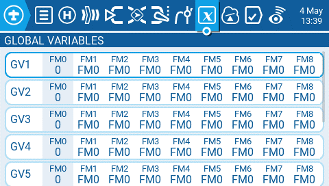
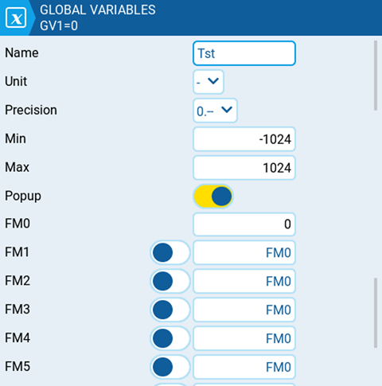
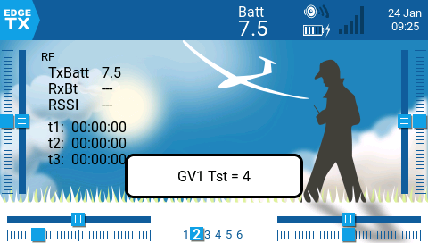

# Global Variables

Global variables are variables whose values are shared across all the configuration screens of a model. Their values can be used in weights, offsets, differential, expo settings, outputs, and in logical switch comparisons.  The **Global Variables** screen of Model Settings shows the value of each global variable for each flight mode.

<figure><figcaption>
Global variables screen
</figcaption></figure>

Selecting a global variable from the global variable screen will give you the following options:

* **Edit** - Opens the global variable configuration screen for the selected global variable.
* **Clear** - Clears the global variable values for all flight modes for the selected global variable.

<figure><figcaption>
Global Variable configuration screen.
</figcaption></figure>

The global variable configuration screen is where you assign a value and other configuration options to a global variable. Additionally, you can select how the value of the global variable is defined for every flight mode - either the value is manually defined or inherited from another selected flight mode. It contains the following configuration options:

* **Name** - Name for the global variable. Three characters are allowed. If left blank, it will use the default GV# as the  name.
* **Unit** - (optional) Allows you to add a **%** label to the displayed values when selected. It DOES NOT affect how the values are calculated.
* **Precision** - Allows you to select the number precision options whole numbers (**0.-**) and decimal (**0.0**). The default value is **0.-**
* **Min** - Defines the minimum that is allowed for the global variable.
* **Max** - Defines the maximum value that is allowed for the global variable.
* **Popup -** When enabled, a popup message will be displayed when the value of a GV changes with the new GV value (see image below).
* **FM0** - The value of the global variable on Flight Mode 0.
* **FM1 -> FM8** -  When the toggle switch is enabled or disabled, the following applies:
  * Toggle switch disabled - global variable value for the selected flight mode is inherited from the flight mode defined in the drop-down.
  * Toggle switch enabled (highlighted) - the global variable value for the selected flight mode is manually defined in the text field.

<figure><figcaption>
Popup message of global variable change
</figcaption></figure>
