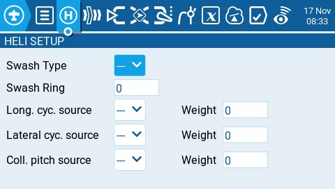

# Heli Setup

The **Heli Setup** page in Model Settings is an optional page that is available on custom-compiled versions of EdgeTX. The heli setup page is often used for collective pitch mixing (CCPM) used in flybared helicopters where the receiver directly controls the swashplate servos. Most flybarless helicopters do not need to configure this page. The outputs of the CCPM mixer are CYC1, CYC2, and CYC3, which need to be assigned to an output channel on the Mixes screen.

<figure><figcaption>
Heli Setup page
</figcaption></figure>

The heli setup page has the following configuration options:

* **Swash Type** - Swash type for your model. Options are **120, 120x, 140, and 90.**
* **Swash Ring** - Set the swash ring limit only as needed. **1** = maximum limit -> **100** or **0** = no limit.&#x20;
* **Long. cyc. source** - Select source input.
* **Lateral cyc.source** -Select source input.
* **Coll. pitch source** - Select source input.&#x20;
* **Weight** - Percentage value of the stick travel to use.&#x20;
