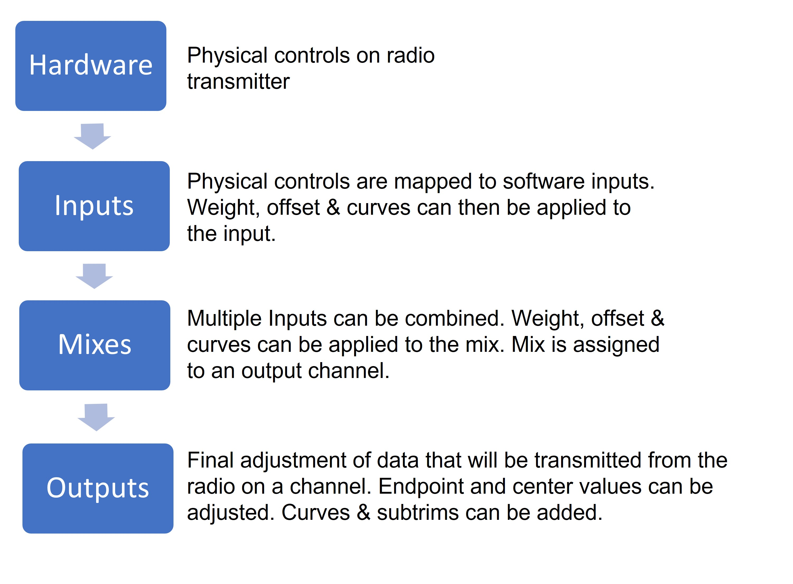
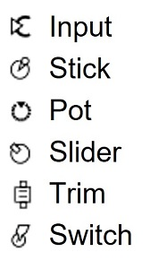

# Inputs, Mixes & Outputs

To be able to support many different types of radio transmitters, EdgeTX uses a generic control data flow that can be applied to any radio transmitter. In this data flow, any of the radio's physical controls (sticks, switches, sliders, pots) can be mapped to an input in the software. These inputs can be directly assigned or combined with other inputs into a single mix. These mixes can be modified by applying weights, offsets, and curves and are then assigned a channel for output. Final adjustments to the control data are made (including subtrims, curves, endpoint, and center values) before finally sending the control data to the RF module. The flowchart below depicts a visual summary of this control data flow. Detailed information about the flow is provided in the following sections [Inputs](mixes.md), [Mixes](mixes.md), and [Outputs](outputs.md).

<figure><figcaption>
Control data flow
</figcaption></figure>

EdgeTX uses the icons below to designate different types of sources.&#x20;

<figure><figcaption>
Source Icons
</figcaption></figure>

