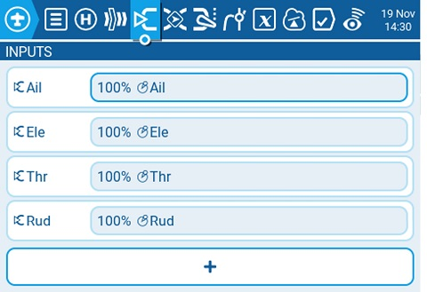
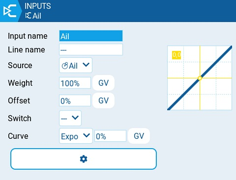
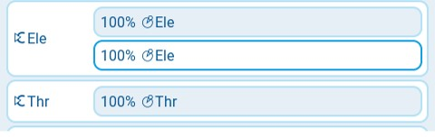
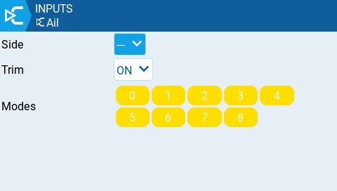

# Inputs

The **Inputs** screen of Model Settings is where you map your physical radio controls (for example: sticks, sliders, and pots) to a software input to be used by the radio. After the control has been mapped it is then possible to apply modifiers to the inputs such as a weight, offset or curve which will then be applied anywhere that input is used. Although it is possible to also assign switches as inputs, it is normally not needed as switch outputs seldomly need to be modified by a weight, offset or curve. By default, EdgeTX will automatically map your contoller sticks to Aileron, Elevator, Throttle, Rudder based on the default channel order defined in [Radio Setup.](../../radio-settings/radio-setup/)


Your input channels may default to a different order based on the settings defined in [Radio Setup](../../radio-settings/radio-setup/).



The Inputs section is also commonly referred to as "**Dual Rates"** as it was previously called this in earlier versions of OpenTX.


<figure><figcaption>
Inputs screen in Model Settings
</figcaption></figure>

Selecting the **+** **button** will show you a list of available inputs that can be configured. After selecting an input, the input configuration page for that input will open. Selecting an existing input will give you the following options:

* **Edit** - opens the input configuration page for that input line.
* **Insert before** - Inserts a new input line before the selected input.
* **Insert after**- Inserts a new input line after the selected input.
* **Copy** - copies the selected input line.
* **Move** - selects the input line to be moved. The input is moved using one of the paste commands after a new line is selected (i.e. cut & paste).
* **Delete** - deletes the selected input line.
* **Paste before** - pastes the copied or moved input line before the selected input line.
* **Paste after** - pastes the copied or moved input line before the selected input line.

<figure><figcaption>
Input Configuration Page
</figcaption></figure>

### Input configuration page

The input configuration page allows you to edit the input configuation parameters. To the right of the configuration parameters, you can see a live graph that shows how your configuration options will affect the slope of the input.

* **Input Name** - Name for the input. Four character are possible.
* **Line Name** - Name of the individual line in the input. Multiple physical inputs can be mapped to one input by adding an additional input line under the input.

<figure><figcaption>
Example of multiple input lines under one input
</figcaption></figure>

* **Source** - The physical control used for the input. In addition to physical controls, you can also specify MAX (always returns 100), MIN (always returns -100), cyclics, trim switches, channel values and more. Moving the physical control after the source has been selected will automatically map it to that input.
* **Weight** - Percentage value of the stick travel to use (often referred to as "rates").
* **Offset** - The value added to or subtracted from the input source.
* **Switch** - The switch that activates the input line. If no switches are defined then it is always active.
* **Curve** - Specifies the type of curve that will be used. The following curve options exist:
  * **Diff** - Multiplies only the range above or below the middle (0) by the specified %.
  * **Expo** -The input value is changed exponentially. Increasing the % will result with a gentle slope near the middle(0). Decreasing the % will result in a steep slope near the middle (0). With a % of 0, the slope will be linear.
  *   **Func** -

      <table><thead><tr><th width="116">Function</th><th width="575">Slope Behavior</th></tr></thead><tbody><tr><td>---</td><td>The slope will be linear.</td></tr><tr><td>X>0</td><td>The range below the middle (0) is always 0. Above the middle (0), the slope is linear.</td></tr><tr><td>X&#x3C;0</td><td>The range above the middle (0) is always 0. Below the middle (0), the slope is linear.</td></tr><tr><td>|X|</td><td>The range above the middle (0), the reaction is linear. The sign is inverted in the range below the middle (0). The curve draws a V-shaped graph.</td></tr><tr><td>f>0</td><td>The range above the middle (0) is always +100. The range below the middle (0) is always 0. The output value will always be either 0 or +100.</td></tr><tr><td>f&#x3C;0</td><td>The range above the middle (0) is always 0. The range below the middle (0) is always -100. The output value will always be either 0 or -100.</td></tr><tr><td>|f|</td><td>The range above the middle (0) is always +100. The range below the middle (0) is always -100. The output value will always be either +100 or -100.</td></tr></tbody></table>
  * **Cstm** - assigns a custom defined curve. See [Curves](../curves.md) for more information about custom defined curves.


Values for weight, offset and curve % can also be defined by a configured global values Selecting the **GV** button will display a list of configured global values to select from.


When selecting the gear button at the bottom of the screen, the following option window will be displayed.

<figure><figcaption></figcaption></figure>

**Side** - Specifies the input range for which this line setting is valid. If you select **---**, it will be valid in the entire range of Source values. If you select **x>0**, it will be valid in the upper half of the value of Source. If you select **x<0**, it will be valid in the lower half of the value of Source.

**Trim** - Specifies whether or not to include the trim values in this input. Additionally, you can select a different trim to use for this input.

**Modes** - Specifies which flight modes this input is active for.
