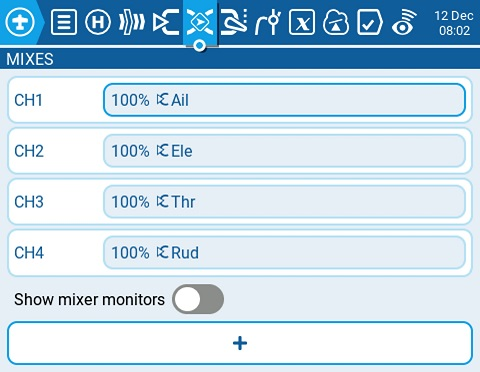
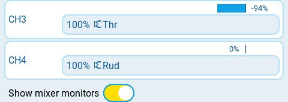
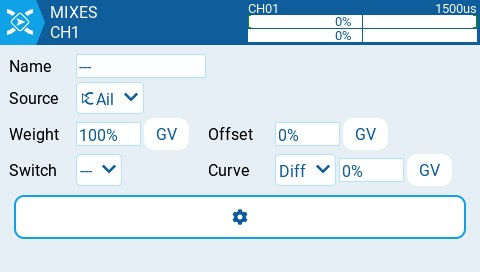
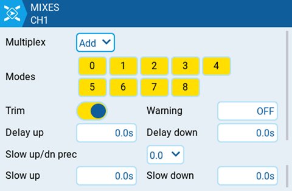

# Mixes

The **Mixes** screen of Model Settings is where several Inputs can be combined into one "Channel Mix". These mixes are then assigned to a radio channel for output. This is also the place where switches, knobs or sliders are assigned to a channel for output. Similar to the Input section, it is also possible to assign a weight, offset or curve to a channel mix.

<figure><figcaption>
Mixes Page
</figcaption></figure>

Selecting the **+** **button** will create a new mix and open the mixes configuration page. Selecting an existing mix will give you the following options:

* **Edit** - opens the mixes configuration page for that mix line.
* **Insert before** - Inserts a new mix line before the selected mix.
* **Insert after** - Inserts a new mix line after the selected mix.
* **Copy** - copies the selected mix line.
* **Move** - selects the mix line to be moved; mix is moved using one of the paste commands after a new line is selected (i.e. cut & paste).
* **Delete** - deletes the selected mix line.
* **Paste before** - pastes the copied or moved mix line before the selected mix line.
* **Paste after** - pastes the copied or moved mix line before the selected mix line.

<figure><figcaption>
Mixes with Show Mixer Monitors enabled
</figcaption></figure>

**Show mixer monitors** - Selecting this option will display a bar graph on the mix channels showing the current value for that mix channel.

<figure><figcaption>
Mixes configuration options
</figcaption></figure>

The upper right portion of the mixes configuration page contains a channel monitor for the selected mix line. It shows the output (top) and mix (bottom) values. The following configuration options are also available:

* **Name** - Name of the mix (optional). Up to 6 characters are allowed.
* **Source** - The source for the mix. In addition to inputs, you can select sticks, pots, sliders, trims, physical and logical switches, heli mixer outputs, trainer import channel values, and other channels.
* **Weight**- Percentage of the source value to use.
* **Offset** - The value added to or subtracted from the source.
* **Switch** - The physical switch that activates this mix line (optional). If no switch is selected, then the mix will be active by default.
* **Curve** - Specifies the type of curve that will be used. See the **curve** section on the [Inputs](inputs.md) page for detailed explanations of the different curve types.&#x20;

<figure><figcaption>
Additional Mixes settings
</figcaption></figure>

* **Multiplex** - The multiplex setting defines how the current mixer line interacts with the others on the same channel. **Add** will add its output to them, **Multiply** will multiply the result of the lines above it, and **Replace** will replace anything that was done before it with its output.&#x20;
* **Modes** - Specifies which flight modes this mix is active for.
* **Trim** - Specifies whether or not to include the trim values in this mix. For the trim values to be included, the trim field for the relevant input must also be enabled on **INPUTS** screen.
* **Warning** -when selected, the radio will beep when this mix is active. You can choose from OFF (0) or beep patterns 1, 2, 3.&#x20;
* **Delay up** - Creates a time delay in seconds between when the source value increases and when it is output.
* **Delay down** -  Creates a time delay in seconds between when the source value decreases and when it is output.
* **Slow up/dn pre** (precision) - Changes the precision for Slow up/dn between 0.0 and 0.00.
* **Slow up** - Adjusts the transition speed for source value increases. Specify the time to transition from -100% to + 100% in seconds. You can specify a range from 0.00 seconds to 25.00 seconds.
* **Slow down** - Adjusts the transition speed for source value decreases. Specify the time to transition from -100% to + 100% in seconds. You can specify a range from 0.0 seconds to 25.0 seconds.
