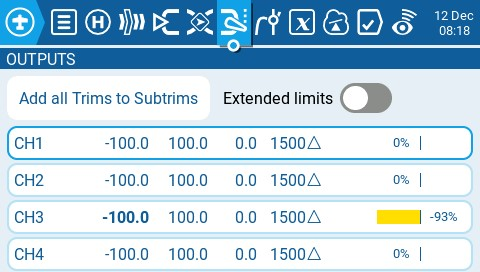
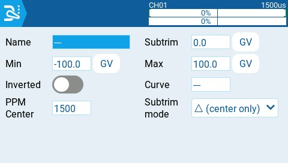

# Outputs

The **Outputs** screen of **Model Settings** is where final adjustments to the control data are made (including subtrims, curves, endpoint, and center values) before finally sending the control data to the RF module. This is where the channel center, limits (to prevent servo binding) and output direction are set.&#x20;


A **Trim** is a temporary adjustment to a flight control normally done while in operation with a trim switch. A **Subtrim** is a semi-permanant adjustment to a flight control that is normally configured when setting up the model in the output settings.&#x20;


<figure><figcaption>
Outputs screen
</figcaption></figure>

The output screen shows all the configured output channels. For each output line, it displays the values for the minimum and maximum limits, subtrim, center point, subtrim mode and channel monitor. The two options below are also available on the output page:

* **Add all Trims to Subtrims** - When selected, adds the current trim value to the subtrim value for each configured output. The trim value is then reset to zero.
* **Extended Limits** - When enabled, it increases the minimum and maximum range for the output values to -150 and 150. Extended limits are necessary if the full range of the control surface cannot be reached with standard limits.

Selecting an output line will give you the following options:

* **Edit** - Opens the output configuration screen.
* **Reset** - Sets the subtrim value back to zero. The trim value is not changed.
* **Copy Sticks to Subtrim** - Adds the current value of the stick deflection as the subtrim value.
* **Copy Trims to Subtrim** - Adds the current trim value to the subtrim value.  The trim value is not changed.

<figure><figcaption>
Outputs Configuration page
</figcaption></figure>

The output configuration screen has the following configuration options:

* **Name** - Name for the Output up to 6 characters.
* **Subtrim** - The subtrim value (max 100). It can also be set to a global variable by pressing the "GV" button and then selecting the desire global variable from the dropdown menu.
* **Min** - Minimum output limit. Commonly used to prevent servo binding on models that use servos for the control surfaces.
* **Max** - Maximum output limit. Commonly used to prevent servo binding on models that use servos for the control surfaces.
* **Inverted** - Select this option if you want to invert the output value.
* **Curve** - Specify the custom curve (in any) that you want to use for this output. See [Curves](../curves.md) for more information about custom defined curves.
* **PPM Center** - Specify the pulse-width value for the center value of the output channel (between 1000 - 2000). Changing this will shift the entire output range, including upper and lower limits.
* **Subtrim mode** - Defines how the subtrim value affects the min/max output values. There are two options:
  * **Center Only** - Only the center value shifts and the upper and lower limits do not change. The reaction of the stick differs between the upper half and the lower half from midpoint.
  * **Symmetrical** - the upper and lower limits will shift according to the shift of the center value. The reaction of the stick is the same on both sides of the midpoint.&#x20;

