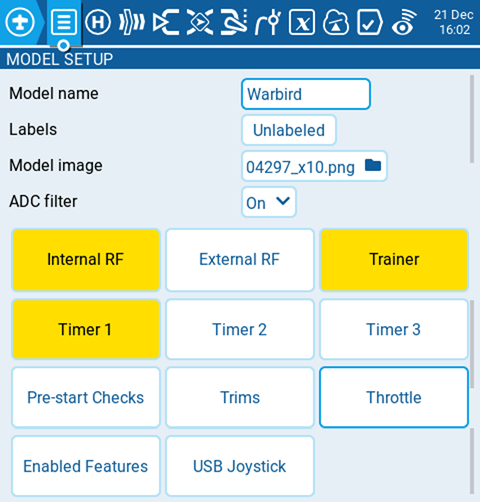

# Model Setup

<figure><figcaption>
Model Setup tab under Model Settings
</figcaption></figure>

The **model setup** page is the default page for model settings and is where you start to configure your model. It contains the following settings:

#### Model name

Enter the desired name for the model. The maximum number of characters is 15.

#### Labels

Here you may assign a label from your defined label list.  By default, the model label will be **Unlabeled.** More information on creating labels can be found on the  [select-model.md](../../select-model.md "mention") page.

#### Model image

When the folder icon is selected, a window will pop up allowing you to select an image file from the images folder on your SD Card.


To avoid performance issues, the model image size should not exceed 192 x 114 pixels. For more information on model image requirements, please see the **Images** portion of the [SD Card](../../radio-settings/sd-card.md) section.



[https://www.skyraccoon.com/](https://www.skyraccoon.com/) has a large repository of free image files that can be used with EdgeTX.


#### ADC Filter

Enables/disables the ADC filter for this model. The _**global**_ option will take the value designated in the radio settings, which is _on_ by default.


The ADC filter is a filter for the proportional channels (sticks, pots, sliders), smoothing out smaller fast movements that occur due to noise in the system electronics. Normally, this filter should be _disabled_ for models with flight controllers.



Timers that are enabled will show as highlighted on the Model Setup screen.


