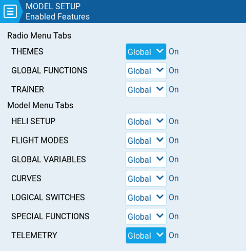

# Enabled Features

<figure><figcaption>
Enabled Features
</figcaption></figure>

The **Enabled Features** section of **Model Setup** allows you to configure which tabs are visible in the selected model's radio setup and model settings area of EdgeTX. You can select the following options:

* **Global** - When selected, the tab will take the global value configured in the **Enabled Features** area in **Radio Setup**. The configured global value will display next to the option.
* **On** - When selected, this tab will be visible when this model is loaded.
* **Off** -  When selected, this tab will not be visible when this model is loaded.


_**Note:**_ Turning off a tab only hides the tab and does not change the items already configured in that tab.

**EXCEPTION:** Turning off the Global / Special Functions tab will disable configured global / special functions for that model.

