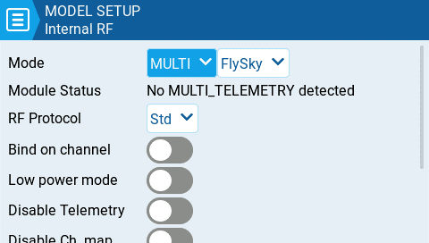
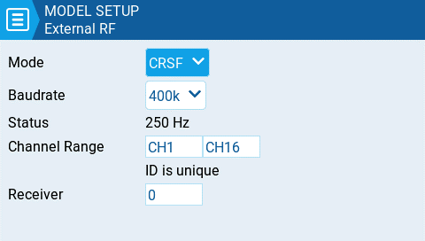

# Internal / External RF

The configuration settings for both the Internal and External RF pages work the same. The only difference is that the **Internal RF** section is for configuring the built-in module and the **External RF** section is for configuring an RF module in the external module bay.

The Internal / External RF modules are "active" for a model when the buttons are yellow and inactive when they are white.

<figure><figcaption>
Internal RF with multi-protocol module selected
</figcaption></figure>

 

<figure><figcaption>
External RF with CRSF selected
</figcaption></figure>

#### Receiver number

The receiver number is a user-assigned number for a model that is sent to the receiver when bound. Each model must have a unique receiver number. However, models using different protocols may have the same receiver number without issues.  EdgeTX will inform you when a receiver number is unique or if it is already being used with a text above the number field.


If using the radio in gamepad mode, both internal and external RF modules should be turned off. This will result in increased performance when connected to a computer via USB.&#x20;


#### Mode Options

* **Off** - RF Module is not used
* **PPM** - Pulse position modulation, used by many generic JR compatible modules.
  * **Telemetry** - No telemetry or MLink
  * **Channel Range** - Channels that will be used.
  * **PPM Frame** – Frame length, pulse length, and polarity of the PPM frame. The frame length is automatically adjusted to the correct value when the number of transmitted channels is changed. However, this automatically assigned value can be manual changed.
* **XJT** -&#x20;
  * **Protocol**- D16, B8, LR2
  * **Channel Range** - Channels that will be used.
  * **Failsafe Mode** - Available in D16 protocol. The receiver will use this setting when the transmitter signal is not being received (signal loss).
    * **Not Set** - failsafe mode is not set.&#x20;
    * **Hold** – The receiver keeps channel values at their last received state from the transmitter.
    * **No pulses** – No PWM pulses are output.
    * **Receiver** – Follows the fail-safe settings configured on the receiver. Follow the instructions that come with the receiver.
    * **Custom** – The receiver changes the channel values to the custom set values.
      * **Custom Set** – Each channel can have its own setting. The options are a value, hold and no pulses.
  * **Receiver Number** -  a user-assigned number for a model that is sent to the receiver when bound
  * **Bind** - This puts the transmitter into bind mode. When in this mode the transmitter will make a chirp sound every 2.5 seconds.
  * **Range** . This puts the transmitter into range check mode. When in this mode, the RSSI value is displayed and a sound is made every 5 seconds.
* **DSM2**
  * **Protocol** - LP45, DSM2, DSMX
  * **Channel Range** - Channels that will be used.
  * **Receiver Number** -  a user-assigned number for a model that is sent to the receiver when bound
  * **Bind** - This puts the transmitter into bind mode. When in this mode the transmitter will make a chirp sound every 2.5 seconds.
  * **Range** . This puts the transmitter into range check mode. When in this mode, the RSSI value is displayed and a sound is made every 5 seconds.
* **CRSF**
  * **Baud Rate** - the speed to which the Transmitter module and the Radio Handset communicate.
  * **Status** - Shows the packet radio configured on the trasmitter module.
  * **Channel Range** - Channels that will be used.
  * **Receiver Number** -  a user-assigned number for a model that is sent to the receiver when bound
* **Multi** - Multiprotocol Module. The configuration options are unique to each selected protocol Configuration options for the multi-protocol module are described here:  [https://www.multi-module.org/using-the-module/protocol-options](https://www.multi-module.org/using-the-module/protocol-options)
* **R9M**
  * **Mode**- FCC, EU, 868MHz, 915 MHZ
  * **Failsafe Mode** - The receiver will use this setting when the transmitter signal is not being received (signal loss).
    * **Not Set** - failsafe mode is not set.&#x20;
    * **Hold** – The receiver keeps channel values at their last received state from the transmitter.
    * **No pulses** – No PWM pulses are output.
    * **Receiver** – Follows the fail-safe settings configured on the receiver. Follow the instructions that come with the receiver.
    * **Custom** – The receiver changes the channel values to the custom set values.
      * **Custom Set** – Each channel can have its own setting. The options are a value, hold and no pulses.
  * **Receiver Number** -  a user-assigned number for a model that is sent to the receiver when bound
  * **Bind** - This puts the transmitter into bind mode. When in this mode the transmitter will make a chirp sound every 2.5 seconds.
  * **Range** . This puts the transmitter into range check mode. When in this mode, the RSSI value is displayed and a sound is made every 5 seconds.
  * **RF Power** - The output power for the transmitter module. The options change based on the selected mode.
* **R9M Access    Note:** In order for the mode **R9M ACCESS** to be visible in the mode dropdown**,** the AUX1 or AUX2 serial port must be configured to **External Module** on the [Hardware](../../radio-settings/hardware.md) page.&#x20;
  * **Channel Range** - Channels that will be used.
  * **Failsafe Mode** - The receiver will use this setting when the transmitter signal is not being received (signal loss).
    * **Not Set** - failsafe mode is not set.&#x20;
      * **Hold** – The receiver keeps channel values at their last received state from the transmitter.
      * **No pulses** – No PWM pulses are output.
      * **Receiver** – Follows the fail-safe settings configured on the receiver. Follow the instructions that come with the receiver.
      * **Custom** – The receiver changes the channel values to the custom set values.
        * **Custom Set** – Each channel can have its own setting. The options are a value, hold and no pulses
  * **Module -** _Please refer to FrSky documentation for these configuration settings_
    * Register
      * Range
      * Options
  * **Receiver No (Number)** -  a user-assigned number for a model that is sent to the receiver when bound
  * **Bind** - This puts the transmitter into bind mode. When in this mode the transmitter will make a chirp sound every 2.5 seconds.
* **GHST** - ImmersionRC Ghost
  * **Channel Range** - Channels that will be used.
  * **Raw 12 bits** - enable 12bit mode
* **SBUS**&#x20;
  * **Channel Range** - Channels that will be used.
  * **Refresh Rate** - Rate of refresh in milliseconds
    * **Inversion** - Normal, Non-inverted
* **FLYSKY**&#x20;
  * **Protocol** - AFHDS3, AFHDS2A
  * **Module Status** - Status of the module
  * **Type** - _Please refer to FLYSKY documentation for these configuration settings_
    * **Module Options**- _Please refer to FLYSKY documentation for these configuration settings_
  * **Channel Range** - Channels that will be used.
  * **Failsafe Mode** - The receiver will use this setting when the transmitter signal is not being received (signal loss).
    * **Not Set** - failsafe mode is not set.&#x20;
    * **Hold** – The receiver keeps channel values at their last received state from the transmitter.
    * **No pulses** – No PWM pulses are output.
    * **Receiver** – Follows the fail-safe settings configured on the receiver. Follow the instructions that come with the receiver.
    * **Custom** – The receiver changes the channel values to the custom set values.
      * **Custom Set** – Each channel can have its own setting. The options are a value, hold and no pulses.
  * **Receiver (number)** -  a user-assigned number for a model that is sent to the receiver when bound
  * **Bind** - This puts the transmitter into bind mode. When in this mode the transmitter will make a chirp sound every 2.5 seconds.
* **LemonRx DSMP**
  * **Channel Range** - Channels that will be used.
  * **Bind** - This puts the transmitter into bind mode. When in this mode the transmitter will make a chirp sound every 2.5 seconds.
  * **Range** . This puts the transmitter into range check mode. When in this mode, the RSSI value is displayed and a sound is made every 5 seconds.
