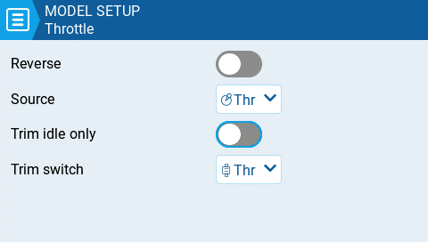

# Throttle

<figure><figcaption>
Throttle page settings
</figcaption></figure>

EdgeTX has to possibility to select a specific source and trim for the model throttle and allows for the following configuration options:

**Reverse:** When enabled, this option reverses the output direction of the configured throttle channel.

**Source:** The source that will be used for the throttle.&#x20;

**Trim idle only**: When enabled, the throttle trim will only affect the bottom portion of the throttle band.&#x20;


For example, with **Trim idle only** enabled, the throttle stick at the lowest point might have a value of -80 and the center point will still be 0 and the highest point of 100. Without this enabled, the throttle stick at the lowest point might have a value of -80 however, the center point will be 20 and the highest point of 100.&#x20;


**Trim switch:** The trim switch that will be used to trim the throttle. It is possible to substitute the throttle trim switch with the aileron, rudder, or elevator trim switches.
