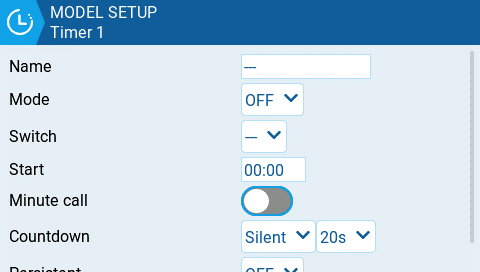

# Timer 1/2/3

<figure><figcaption>
Timer configuration page
</figcaption></figure>

EdgeTX provides 3 timers that can be custom programmed.  Below are the configuration options.

**Name:**  Name of the timer

**Mode**:

* **OFF**- The timer is not used
* **ON** - The timer runs all the time
* **Start** -The timer starts once the configured switch is activated. After the time is started, the timer ignores the switch position.
* **Throttle** - The timer starts once the throttle is raised and the configured switch is activated. The timer will stop counting if either the throttle position is lowered back to the minimum value or the configured switch is deactivated.
* **Throttle %** - The timer counts proportionally to the throttle. It counts in real time at full throttle and at half speed at 50% throttle.
* **Throttle Start** - The timer starts once the throttle is raised and the configured switch is activated. After starting, the timer ignores the throttle position and will keep counting unless the switch is deactivated.


**Throttle**, **Throttle %**, and **Throttle Start** can be triggered by a switch, dial, or the value of another channel instead of just the throttle. This is specified in **Source** field of the [throttle.md](throttle.md "mention") section in **Model Setup**


**Switch-** Select the switch that will trigger the timer to start.  If no switch is selected, the timer will trigger based only on the configured mode. In addition to a switch, you can also select a trim, a telemetry source (triggered when telemetry data is received from that source), or physical activity (stick movement or button press) (labeled as **ACT**)


Those items with a "!" mark in front of the trigger name mean that the condition is reversed. For example, "!SA-" means "when SA switch is not in middle/center position (= up or down)".


**Start-** The time used for the timer's advanced functions.  The default value is 00:00 and when left as such, the timer operates like a stopwatch, counting upward until stopped.  If a different time is entered in this box, then the additional **Direction** drop-down menu option will appear.

**Direction** - If set to **Show Remaining**, the counter will function like a countdown timer - counting down from the designated time to zero and then alerting the user.  If set to **Show Elapsed**, the timer functions like an alarm, counting up from zero until the designated time and then alerting the user.

**Minute Call** - If selected, you will be notified every minute that passes as described in the **Count Down** option.

**Count Down:**

* **Silent** - No notification is given until the timer reaches zero. When it reaches zero, you will hear one beep.
* **Beeps** - The radio will beep every second starting at the time designated.
* **Voice** - The radio will count down by second starting at the time designated.
* **Haptic** -The radio will vibrate every second starting at the time designated.
* **Beeps & Haptic** - The radio will beep and vibrate every second starting at the time designated.
* **Voice & Haptic** - The radio will count down and vibrate by second starting at the time designated.

**Persistent:**

* **Off** - The timer value is reset when switching models or when the radio is turned off / on.
* **Flight** - The timer value is NOT reset when switching models or when radio is turned off / on. The timer value is only reset when the **Reset flight** option is selected in the [Reset telemetry ](../../reset-telemetry.md)menu.
* **Manual Reset -** The timer value is reset only when it is individually selected to be reset (example: Reset timer1) in the [Reset telemetry ](../../reset-telemetry.md)menu.


The **Flight** persistent setting can be set for multiple timers and then these timers can be reset simultaneously with the **Reset flight** option.


