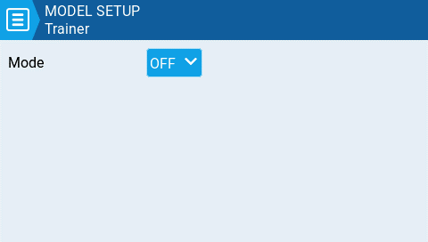

# Trainer

<figure><figcaption>
Trainer Screen
</figcaption></figure>

The **Trainer** screen is where you can configure the CPPM passthrough mode and method.  When enabled, this allows the CPPM signals from a radio in _**Slave**_ mode to be passed through to another radio in Master mode which will then pass the signal to the model it is connected to. CPPM passthrough can be used for several different use cases, such as: connecting a head tracker, Instructor / Student training mode, and controlling complex models that require more stick inputs than available on a standard transmitter.&#x20;

**Master mode** - This is the mode for the radio that will be connected to the model. This radio also shall configure the special/global function (Trainer) to activate the passthrough mode. When the passthrough mode is activated, the CPPM signals from the radio in _**Slave mode**_ will be sent to the model for control.

**Slave mode** - This is the mode for the radio that will pass it's CPPM values to the radio in _**Master mode,**_ which are then sent to the model.

Below are the possibile configuration options:

* **Off** - Trainer mode is not used for this model.&#x20;
* **Master / Jack** - Master mode using a cable connection.
* **Slave / Jack** - Slave mode using a cable connection.
  * **Channel Range** - This is the range of channels that will be sent to the radio in Master mode. Channel 10 is the recommended last channel to use.
  * **PPM Frame** - The first field is the length of the PPM frame. The second field is the stop length/delay between pulses. The dropdown is to select the polarity of the signal. The frame length is automatically adjusted to the correct value when the number of transmitted channels is changed. However, this automatically assigned value can be manual changed. _**Note**: In most cases, the default setting does_ not _need to be changed._
* **Master / Bluetooth** - Master mode using a Bluetooth connection (if installed in radio).
* **Slave / Bluetooth** - Slave mode using a Bluetooth connection (if installed in radio).
* **Master / Multi** - Master mode using an additional externally mounted Multi-protocol module for the connection. For more information on this setup, see [set-up-wireless-trainer-with-mpm.md](../../../edgetx-how-to/set-up-wireless-trainer-with-mpm.md "mention")


Further configuration settings for trainer mode can be found under radio settings, [trainer.md](../../radio-settings/trainer.md "mention")


