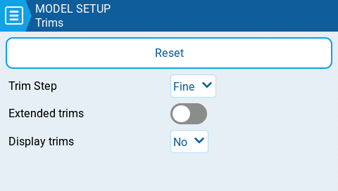

---
metaLinks:
  alternates:
    - >-
      https://app.gitbook.com/s/2n2y0XsJcrhXt3asceP0/color-radios/model-settings/model-setup/trims
---

# Trims

<figure><figcaption>
Trims settings page
</figcaption></figure>

Trims are used adjust the center position of a given stick axis. EdgeTX has the following time configuration options:

**Reset** - This resets all trim values to zero.

**Trim Step:** Defines the amount of increase/decrease in trim when the trim switch is pressed.&#x20;

* Coarse = 1.6%
* Medium = 0.8%
* Fine = 0.4%
* Extra Fine = 0.2%
* Exponential = 0.2% near the center and the step value increases exponentially as the distance from the center increases.

**Hats Mode (select radios)**: On radios that use the hat/D-pad control as trim keys (e.g. the NV14-family: NV14, EL18, PL18, PL18EV), selects whether the control is used for trims or menu interaction.

**Extended Trims**: Increases the maximum trim adjustment value from **±**&#x32;5% to **±**&#x31;00%.


When switching from extended trims to normal trims, the extended trim value will remain until the trim is adjusted, then it will jump to the max/min normal trim value.


**Display trims:** Option to display the numerical trim value on the trim bar. Options are:

* **No -** Does not display the numerical trim value on the trim bar
* **Yes** - Displays the numerical trim value on the trim bar once the trim is no longer at zero.
* **Change -** Momentarily displays the numerical trim value on the trim bar (2 seconds) once the trim is no longer at zero.
