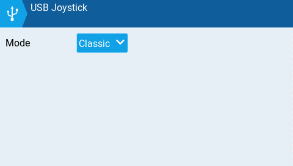
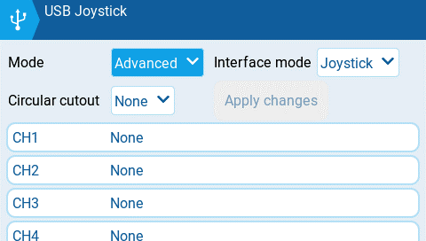
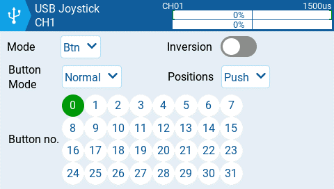
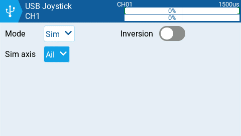

# USB Joystick

The USB Joystick has two possible modes, **Classic** and **Advanced**.&#x20;

<figure><figcaption>
USB Joystick Classic mode
</figcaption></figure>

In **Classic mode**, the radio's configured output channels will be sent to the target device in numerical order and mapped to the device's preconfigured USB controller axes and buttons. Below is the default channel mapping for Microsoft Windows.


If using the radio as a USB Joysitck, both internal and external RF modules should be turned off. When configured as such, the mixer will run at 1000Hz when in Joystick mode (which is needed for F.Sim competitors). Additinally, it also displays mixer run time in statistic/debug screen. This will result in increased performance when connected to a computer via USB.&#x20;


* Ch1 - X Axis
* Ch 2 - Y Axis
* Ch 3 - Z Axis
* Ch4 - X Rotation
* Ch 5 - Y Rotation
* Ch 6 - Z Rotation
* Ch 7 - Dial
* Ch 8 - Slider
* CH 9 - Ch 32 - Buttons 1 - 24

<figure><figcaption>
USB Joystick Advanced mode
</figcaption></figure>

In **Advanced mode** you can configure the following options:

**Interface mode:** This indicates to the target device (the device you are connecting your transmitter to) what type of device you are connecting. The options are **Joystick**, **Gamepad**, **MultiAxis.** &#x20;


**Note:** Currently there is a limitation in MS Windows that may limit your transmitter to being only detected as a Joystick, regardless of what is selected in this option. In MacOS, Linux and Andriod this functions properly.


**Circular cutout**: For axis pairs (X-Y, Z-rX): By default, the range of the axis pairs is a rectangular area. With this option, the axis will be limited to a circular area (like gamepad controllers commonly are). Options are : **None** or **X-Y, Z-rX** or **X-Y, rX-rY** or **X-Y, Z-rZ**

**Output channels 1-32**

**Mode**: For each output channel, you can select the mode that you want to use for that channel. The available options are **None**, **Btn**, **Axis**, **Sim**.

**None** - Channel is not used

<figure><figcaption>
Button mode options for a selected channel
</figcaption></figure>

**Btn** - Channel is used to simulate a button. Configuration options include:

* **Inversion** - Inverts the output channel signal. Options are: **On** / **Off**
* **Button Mode** -
  * **Normal** - Each postion of a multiposition switch is represented by a button. The current switch state is represented by a continous button press.
  * **Pulse** - Similar to "Normal" mode. However, instead of continous button press it is represented by a short button press.
  * **SWEmu** - The toggle switch emulations a push button. The first press turns the virtual button on, the second press turns it off.
  * **Delta** - The change of the output channel is represented by 2 buttons. While the output value is decreasing, the first button is pressed. When the output value is increasing, the second button is pressed. If there is no change, then no buttons will be pressed.
  * **Companion** - This option should be selected when using your transmitter to control the simulator in EdgeTX Companion.  It allows the multi-position switches to function properly in the simulator.
* **Positions** - The type of button that will be simulated.&#x20;
  * **Push -** will only map to one button
  * **2POS - 8 POS** - will map to the number of buttons that the switch has (ex: 3POS will map to 3 buttons).
* **Button No:** The button number that the output will be mapped to and sent to the target device as.

<figure><figcaption>
Axis mode options for a selected channel
</figcaption></figure>

**Axis -** The channel is used to simulate an axis and will be mapped to one of the target device's default axes.

* Axis options are: X, Y, Z, rotX (rotation x), rotY, rotZ

<figure><figcaption>
Sim mode options for selected channel
</figcaption></figure>

**Sim -** The channel is used to simulate a common sim axis and it will be listed on the target device as the selected option (ex: Thr)

* Sim Axis options are: **Ail**, **Ele**, **Rud**, **Thr**, **Acc**, **Brk**, **Steer**, **Dpad**
