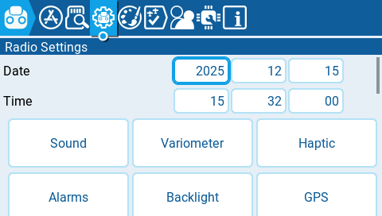

---
metaLinks:
  alternates:
    - https://app.gitbook.com/s/2n2y0XsJcrhXt3asceP0/color-radios/radio-settings
---

# Radio Settings

<figure><figcaption>
Top of the Radio Settings section
</figcaption></figure>

The Radio **Settings** section contains all the options to configure your radio. Across the top of the page you will see icons that will take you to different pages of radio settings when selected. The default screen for the radio settings is the [Tools ](apps.md)screen.&#x20;

Icons at the top of the radio settings screen include (in order from left to right):

* [Apps](apps.md)
* [Storage](storage.md)
* [Radio Settings](radio-settings/)
* [Themes](themes.md)
* [Global Functions](global-functions.md)
* [Trainer](../model-settings/model-setup/trainer.md)
* [Hardware](hardware.md)
* [About](about.md)
