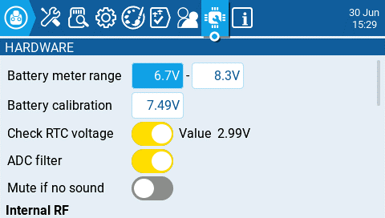
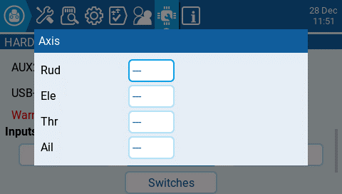
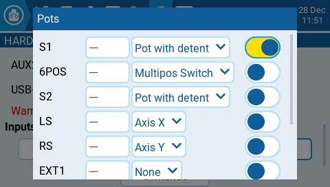
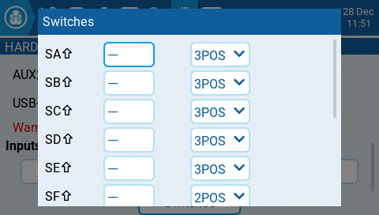
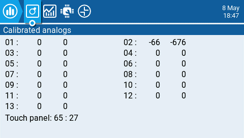

# Hardware

<figure><figcaption>
Hardware Screen
</figcaption></figure>

The **Hardware** screen is where you configure hardware specific-settings for your radio. It contains the following configuration options:

**Battery meter range** - Sets the maximum and minimum voltage for the battery meter. This should be set based on the type of battery you are using.

**Battery Calibration** - Set this value to match the transmitter battery voltage.

**Check RTC voltage** - When enabled, checks the RTC battery at startup and warns you if the battery voltage is low.

**ADC Filter** - Enables or disables the ADC Filter. This filter can also be enabled/disabled per model in the model settings.


The ADC filter is a filter for the proportional channels (sticks, pots, sliders), smoothing out smaller fast movements that occur due to noise in the system electronics. Normally, this filter should be _disabled_ for models with flight controllers.&#x20;


**Mute if no sound: -** When enabled, puts the transmitter in mute mode until a sound needs to be played. This prevents interference noise from high-powered TX modules from coming out of the transmitter speakers.&#x20;

### **Internal RF Type**

Select the module type for the internal module bay. Options are: **Multi, XJT, ISRM, CRSF**.  When **CRSF** is selected, you can also select the baud rate. You can read more about baud rates [here](https://www.expresslrs.org/2.0/quick-start/transmitters/tx-prep/).

### **External RF Sample Mode**&#x20;

Options are Normal and OneBit. The default setting of **Normal** should be used by most users. Only users of  X9D+ and X7 radios may want to use **OneBit** mode.


The X9D+ and X7 radios have a slow inverter that causes problems with the reception of fast UART signals, resulting in telemetry warnings and issues with LUA scripts using the CRSF protocol. A 10k resistor on the circuit board could be replaced to fix the issue, but this was not always effective. EdgeTX has developed OneBit Mode, which changes the UART sampling behavior to ignore slow leading edges, allowing the CRSF protocol to be run at the full 400k baud rate without hardware modifications to the radio.


### **Bluetooth**


_**Note:** This option is only visible on custom compiled versions of EdgeTX with the **Bluetooth** flag enabled._


**Mode - mode that the bluetooth module will be used in. The options are:**

* **---** - Off
* **Telemetry** - used for sending telemtry data over bluetooth.
* **Trainer** - used for bluetooth trainer mode

**Name -** the name the bluetooth device will be seen as.

**Settings Cog Icon** - when selected will show you:

* **PIN Code** - PIN code for bluetooth device in the radio (visible in **Telemetry** mode only)
* **Local addr -** Identifying address of the bluetooth device in the radio.
* **Dist addr -** Identifying address of bluetooth device that radio is connected to.

### **Serial Port**&#x20;

Displays a list of available auxiliary serial ports that can be configured and used. The listed ports are based on the ports that are available in the particular radio hardware. The ports listed below are for example only and may not be present in your radio.

* **AUX1** - First available auxiliary serial port can be configured with the below options:
  * **OFF** - Turned off.
  * **Telem Mirror** - The same telemetry data that goes to the external module bay is sent to the serial port.&#x20;
  * **Telemetry In** - Receive telemetry data over the serial port.
  * **SBUS Trainer** - Connect the Instructor and Student radios over the serial port.
  * **LUA** - Send/receive data to/from Lua script.
  * **GPS** - Receive GPS telemetry data over the serial port.
  * **CLI** - Send commands to the radio via the command line.&#x20;
  *   **External Module** - This allows configuring the external access mod on runtime rather than by compilation option. First, configure the hardware port (only available on `AUX1` as `AUX2` has no TX DMA)\
      

      Then the module can be chosen:\
      
  * **AUX2** - Second available auxiliary serial port (depending on hardware), which has the same options as AUX1, except for External Module&#x20;
  * **USB-VCP** - Virtual COM Port. This is one of the options presented when connecting your radio to the PC with most radios. Is often set to 'CLI' for radios with internal ExpressLRS RF modules in order to do firmware updates.
* **Port Power** - Enables or disables the power output on the power supply pins next to serial ports that are available on some radios (presently only TX16S has this feature).

### Inputs

**Calibration** - For calibrating your physical radio controls (sticks, pots, sliders, & 6-position switch). The radio will prompt you through the calibration steps.&#x20;


For your gimbal calibration, use a left-to-right & up-to-down movement for the gimbals, not a circular movement! Additionally, use the normal amount of pressure at the endpoints. Excessive endpoint pressure will cause the gimbal to be miscalibrated. Also, do not forget to calibrate your 6-position switch!


#### Axis, Pots, and Switches Buttons

<figure><figcaption></figcaption></figure>

 

<figure><figcaption></figcaption></figure>

 

<figure><figcaption></figcaption></figure>

Selecting one of the Axis, Pots, or Switches buttons will open the configuration screen.  On these screens, you will see all the physical radio controls pre-defined by EdgeTX.  Here you can add a 3 character label to the control as well as change the type of control as needed.  Addionally, controls listed under the Pots screen can also be configured to be inverted.

### Debug

<figure><figcaption>
Analog Debug Screen
</figcaption></figure>

 

<figure><figcaption>
Switches Test Screen
</figcaption></figure>

The debug section allows for testing and debugging of the analog controls and keys.

**Analogs**  - These screens will show you the data for your analog controls (Sticks, Sliders, Pots, 6-position switch) and the touch screen on your radio. There are four views - Calibrated analog, Filtered Raw Analog with deviation, Unfiltered raw analog, and Min Max and range.&#x20;

**Keys** - This screen will show you the digital data for your keys, switches, trims, and the rotary encoder (roller).
