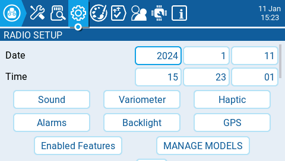

# Radio Setup

<figure><figcaption>
Radio Setup Screen
</figcaption></figure>

The **Radio Setup** screen is where you configure basic settings for your radio. It contains the following options:

**Date** - The current date. This date is used for the SD card log files.

**Time** - The current time. This time is used for the SD card log files.

**Additional Settings Buttons** - Additional configuration options for the named areas are available when selecting these buttons.  More information about these configuration settings is on the next page - [Additional Radio Settings](additional-radio-settings.md)

**Splash Screen** - Duration that the splash screen will be displayed.

**Startup Sound** - Toggles whether to enable/disable startup sound.

**Pwr Off delay** - The delay between when the power button is pushed and when the radio shuts off. The options are: **0s, 1s, 2s, 3s, 4**s. _It is recommended to set at least a 1s delay in order to prevent the radio from being shut off in the case of an accidental button press._

**Owner ID** - Custom registration ID used only for users with ISRM modules.

**Country code** - Used by some RF modules to ensure adherence to local regulatory RF requirements. Options are **America, Japan, Europe.**

**Voice language** - Language for the voice pack. This setting and the voice pack folder on the SD card must match for the sounds to be played.

**Units** - Units of measure. Options are **metric** or **imperial**.

**PPM Units** - Level of accuracy for PPM values are displyed. Options are **0.-** or **0.0**

**Play delay** (sw. mid pos) - The minimum time in milliseconds a switch must be in the middle position before a special function will get activated. This is used to prevent the middle position from being activated on a three-position switch when switching from low position to high position.

**USB Mode** - Sets the default action when a USB cable is plugged into the USB data port and the radio is powered on. Options are: **Ask**, **Joystick**, **Storage**, and **Serial**.

**Hats Mode:** how the hat switches will function (_**NV14 & EL18  only**_).

* **Trims** **only**: The Trim hat switches will be used to adjust the trim values only.
* **Keys only**: The Trim hat switches will be used to navigate the menu options (as described below)
* **Switchable**: Trim hat switch functionality can be changed between **Trims** and **Keys** on-the-fly.

**Rotary Encoder Mode** - Set to **Normal** by default. The **Inverted** option reverses the direction of the roller.

**Default Channel Order** - The default channel order for new models and the trainer screen. The letters stand for: **A** = Aileron (Roll), **E** = Elevator (Pitch), **T** = Throttle, **R** = Rudder (Yaw). Changing this setting does not affect existing models.

**Mode** - The stick mode that will be used for the transmitter. Defined by what actions the left stick takes. The options are:

<table><thead><tr><th width="181">Option</th><th width="148">Left stick  H</th><th width="149">Left stick  V</th><th width="133">Right stick H</th><th>Right stick V</th></tr></thead><tbody><tr><td>1: Left = Rud+Ele </td><td>Rudder (Yaw)</td><td>Elevator (Pitch)</td><td>Aileron (Roll)</td><td>Throttle</td></tr><tr><td>2: Left = Rud+Thr</td><td>Rudder (Yaw)</td><td>Throttle</td><td>Aileron (Roll)</td><td>Elevator (Pitch)</td></tr><tr><td>3: Left = Ail+Ele</td><td>Aileron (Roll)</td><td>Elevator (Pitch)</td><td>Rudder (Yaw)</td><td>Throttle</td></tr><tr><td>4: Left = Ail+Thr</td><td>Aileron (Roll)</td><td>Throttle</td><td>Rudder (Yaw)</td><td>Elevator (Pitch)</td></tr></tbody></table>

