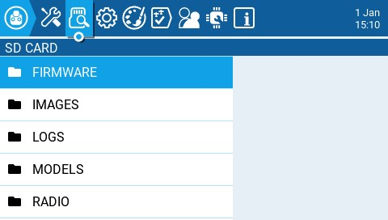
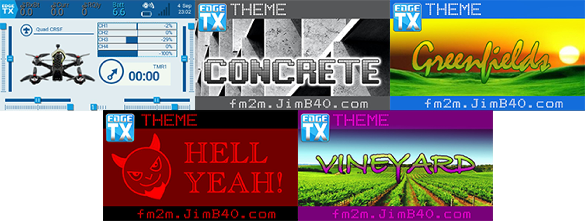

# SD Card

<figure><figcaption>
SD Card screen
</figcaption></figure>

The **SD Card** screen shows you the contents of your SD card, allows you to navigate the folders and interact with the files in the folders. All folders contain a README.txt file that describes what type of files belong in this folder. After selecting a file in one of the folders, you will be presented with some of the options below, depending on the file type that was selected:

* **Assign bitmap** - Assigns the selected image file as the model image of the currently selected model.
* **Copy** - Copies the selected file.
* **Delete** - Deletes the selected file.
* **Execute** - Executes a Lua script. Used for files ending in **.lua**
* **Flash \[target]**- Flashes the selected firmware file to the select target module.  Examples: Flash Bootloader, Flast Internal Multi.
* **Paste** - Pastes the copied file.
* **Play** - Plays the selected sound file.
* **Rename** - Renames the file.
* **View text** - Views the selected **.txt**, **.csv**, and **.lua** files.&#x20;

The folders listed on the SD card screen are the same as what you will see when connecting your radio to your computer. Below are the folder names and explanations for all the folders that come with the default EdgeTX SD Card.&#x20;

### FIRMWARE

Place the firmware files that you want to flash in this folder. This folder is empty by default (except for the readme.txt file). When selecting a .bin file you will be given the option to flash the firmware to a particular module. Also, only firmware files in this location will be visible from the bootloader menu. Selecting a .frsk file will give you the option to "Flash RX by int OTA".

### IMAGES

Place your custom model or splash screen image files in this folder. This folder is empty by default (except for the readme.txt file). Selecting an image file will give you the option to **Assign Bitmap**, which assigns the selected image file as the model image of the currently selected model.

The ideal image size for _model images_ used for thumbnails on the **Model Manager** screen is 156x92 pixels. If you plan to use the _**Model Info**_ widget, you may want a increase the image size to 192x114 pixels for better visual quality at the increased size. For performance reasons, it is NOT recommeded to use a higher resolution image. The picture format should be .png. The image file name should not exceed 9 characters.&#x20;

The ideal image size for _Splash Screen images_ is the actual radio screen size (480x272 pixels for most color screen radios). The picture format should be .png. The image file name must be splash.png.  Screen dimensions for the supported color screen radios can be found [here](https://github.com/EdgeTX/edgetx-sdcard).  &#x20;

Users can configure a custom image to be displayed during the radio shutdown by adding a custom `shutdown.png` to the **IMAGES** folder.


Note: Although larger image sizes will work as they will be scaled, they take up more memory and will cause degraded performance with the user interface.



Note: The maximum number of image files that EdgeTX can properly display in the image select dropdown is 799. Therefore, the maximum number of files in this folder should not exceed 799.



[https://www.skyraccoon.com/](https://www.skyraccoon.com/) has a large repository of free image files that can be used with EdgeTX.


### LOGS

This is where the log files that are configured in the [special function](../model-settings/special-functions.md) **SD Logs** are written. These files can be viewed with the **View text** option. This folder is empty by default (except for the readme.txt file).

### MODELS

This is where the model files, label information, and preflight checklists are stored.  Each model will have a **model\[#].yml** file that contains all configured options. Additionally, there is a **labels.yml** file that contains all the label information for your models.&#x20;

Models that are deleted via the radio will be moved to the **DELETED** folder that is included in this folder. The remaining model files are what will be visible on the **Model Select** screen.

Any model files that are found in this folder that are not listed in the **Models.yml** file (if used) will be moved to the **UNUSED** folder.

If you have configured the **Display checklist** option in model settings, the model notes file goes in this folder. The model notes file must be a .txt file and must have the EXACT same name as the model it is for, for example: Mobula6.txt. The text in the file is up to the user.

### RADIO

This folder contains the **radio.yml** file. This file contains all the radio configuration data. If this file is corrupted or missing, the radio will go into **Emergency Mode** and will create a new radio.yml file with the default settings.&#x20;


If the radio.yml file is manually edited, the **manuallyEdited:** tag must be set to **1** in the radio.yml file or the radio will think it is corrupted, go into **Emergency Mode** and will create a new radio.yml file with the default settings. The original .yml file will be saved in the folder.


### SCREENSHOTS

This is where the screenshot image files that are configured in the [special function](../model-settings/special-functions.md) **Screenshot** are written. This folder is empty by default (except for the readme.txt file).

### SCRIPTS

This folder and its subfolders are where the Lua scripts get placed. It contains the following sub-folders by default. You can download additional Lua scripts from [https://github.com/EdgeTX/lua-scripts](https://github.com/EdgeTX/lua-scripts).

* **Functions** - This folder is where the functions Lua scripts that can be activated by the [special function](../model-settings/special-functions.md) **Lua Script** must be placed. This folder is empty by default (except for the readme.txt file).  More information about function Lua scripts can be found here: [Function Scripts](https://luadoc.edgetx.org/part\_i\_-\_script\_type\_overview/function\_scripts).
* **Mixes** - This folder is where the Lua mixer scripts shall be placed. This folder is empty by default (except for the readme.txt file). More information about Mixer Lua scripts can be found here: [Custom Mixer Scripts](https://luadoc.edgetx.org/part\_i\_-\_script\_type\_overview/mix)
* **Tools** - Contains the Lua scripts that are available in the [Tools](tools.md) screen.&#x20;
* **Wizards** - Contains the Wizard Lua scripts that are available in the [Tools](tools.md) screen.&#x20;

### SOUNDS

This folder is where the EdgeTX sound packs for your radio get placed. The sound packs are language-specific and correlate to the **Voice language** option in **Radio Setup**. Selecting a sound file from this folder will give you the option **Play**, which plays the selected sound file.

Sound packs are available for manual download at: [https://github.com/EdgeTX/edgetx-sdcard-sounds/releases](https://github.com/EdgeTX/edgetx-sdcard-sounds/releases).  It is also possible to create custom sounds to use in EdgeTX. For your custom sounds to be playable by EdgeTX ensure that they meet the following criteria:

* File Name: 123456.wav (up to 6 characters plus .wav)
* Sample Rate: 32 kHz (or 16 Khz, 8Khz)
* Bits / Sample: 16 (or 8)
* Tracks: 1, mono
* Compression Codec: PCM


Note: The maximum number of sound files that EdgeTX can properly display in the sound select dropdown is 799. Therefore, the maximum number of files in this folder should not exceed 799.



For a demonstration video of how to make your own custom sounds that will work with EdgeTX, check out: [https://www.youtube.com/watch?v=DqF7HUsFrnE](https://www.youtube.com/watch?v=DqF7HUsFrnE)


### TEMPLATES

This is where model template files are stored. By default, it will have the following sub-folders:

* PERSONAL - If you save your models as templates, then they get stored here.&#x20;
* SoarETX - A collection of sailplane templates by: Jesper Frickmann
* Wizard - Simple model templates that use the Lua Wizard scripts to configure the models.

### THEMES

This folder contains the theme packs for EdgeTX. The EdgeTX SD card comes with several theme packs automatically installed.&#x20;

<figure><figcaption>
EdgeTX Installed theme packs
</figcaption></figure>

&#x20;You can download and add additional themes from: [https://github.com/EdgeTX/themes](https://github.com/EdgeTX/themes).

### WIDGETS

This is where the widget files are stored. You can add additional widgets to this folder to use with EdgeTX. For more information about the widgets that are pre-installed with EdgeTX, see [Widgets](../screen-settings/widgets.md). You can download additional widgets from [https://github.com/EdgeTX/lua-scripts](https://github.com/EdgeTX/lua-scripts).
