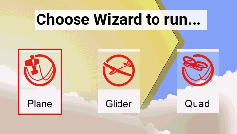

# Tools

<figure><figcaption>
Tools Screen
</figcaption></figure>

The **Tools** page in Radio Settings is where you can select Lua script-based tools for execution. Lua scripts that are located on the SD card in the **Tools** folder will be listed here. Selecting a tool will execute it in full-screen mode. By default, EdgeTX includes several tools. Other tools can be downloaded and added to the SD card as well.  The following tools are included in the default EdgeTX SD card.&#x20;

#### Model Locator (by RSSI)

<figure><figcaption>
Model Locator tool
</figcaption></figure>

The Model Locator tool helps to find a lost model based on the RSSI (if still available). The widget produces an audio representation (variometer style) of the RSSI from the lost model. The widget will also display the RSSI in a visible colorized bar (0-100%).

#### Spectrum (INT)

<figure><figcaption>
Spectrum Analyzer (INT) tool
</figcaption></figure>

The Spectrum Analyzer tool will show the strength of signals in the 2.4GHz band. It uses the internal MULTI-Module as a 2.4GHz spectrum analyzer.

The display shows frequencies on the 2.4GHz spectrum, from 2400MHz to 2480MHz. The X (horizontal) axis shows the frequency in MHz and the Y (vertical) axis shows relative signal strength.

**T:** Frequency at the center of the plot (fixed at 2440MHz)\
**S:** Bandwidth of the plot (fixed at 80MHz)\
**T:** Position of the cursor (vertical line)

Pressing **ENT** and scrolling left and right allows the **T** value to be changed, which will move the vertical line to highlight a specific frequency.

#### Wizard Loader

<figure><figcaption>
Wizard Loader tool
</figcaption></figure>

 

<figure><figcaption>
Plane Wizard
</figcaption></figure>

The Wizard Loader tool assists you in setting up a new model by running a setup wizard for a particular model type. Once the model type is selected, the wizard will take you through a series of prompts and then configure your selected model based on the information provided.&#x20;

_**NOTE: The wizard does not create a new model, it only configures the currently selected model. You must manually create a new model first and then run the wizard. If you run this wizard on an already configured model, it will overwrite your model settings!**_


Additional EdgeTX compatible Lua scripts can be downloaded from: [https://github.com/EdgeTX/lua-scripts](https://github.com/EdgeTX/lua-scripts)

