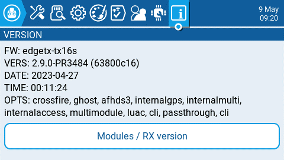
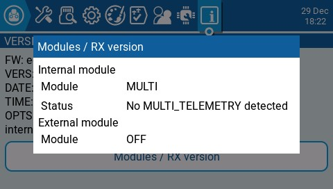

# Version

<figure><figcaption>
Version screen
</figcaption></figure>

The Version screen displays information about the current EdgeTX version that is being used:

* **FW** - Firmware name
* **VERS** - Firmware version
* **DATE** - Date firmware was compiled
* **TIME** - Time firmware was compiled
* **OPTS** - Build options that were enabled when compiled.


A complete list of build options can be found here: [https://github.com/EdgeTX/edgetx/wiki/Compilation-options](https://github.com/EdgeTX/edgetx/wiki/Compilation-options)


<figure><figcaption>
Modules / RX Version screen
</figcaption></figure>

The **Modules / RX Version** gives you information about the activated RX modules for the currently selected model.
