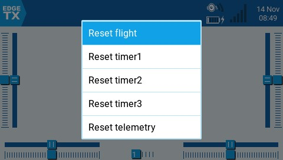

# Reset Telemetry

<figure><figcaption>
Reset telemetry screen
</figcaption></figure>

**Reset flight** - When selected, this option:&#x20;

* Resets all timers configured with a persistence setting of **Flight** to zero.
* Resets all discovered telemetry sensor values.
* Resets all logical switch states
* Triggers the same checks as loading the model  - i.e. throttle position, switch state, is failsafe set check, display pre-flight checklist if configured, stuck keys test, etc.

**Reset timer 1 / 2 / 3** - Resets only the selected timer to zero regardles of the configured persistence setting.

**Reset telemetry** - This option resets all discovered telemetry sensor values.
