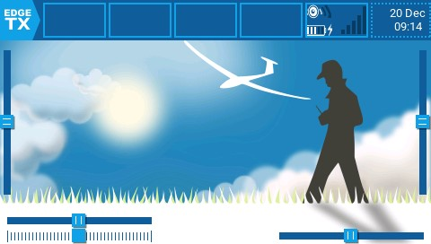

# Screen Settings

The **Screen settings** section of EdgeTX is where you can customize your main views and add additional views (up to 10 in total). When selecting **Screen Settings** from the main navigation menu it will open **Main view 1**. If other main views have been added, you may select them from the number tab at the top of the screen to adjust their settings. All main view tabs have the following configuration options and are configured individually:

<figure><figcaption>
Main view 1 screen
</figcaption></figure>

* **Layout** - Selects the screen layout for the widgets. It is possible to divide the screen in up to two columns and up to 4 rows, with a widget in each cell.
* **Setup Widgets** - see [Setting up widgets](./#setting-up-widgets) below.
* **Top bar** - Toggles whether the top widget bar will be visible on the selected main view.
* **Flight mode** - Toggles whether the flight mode name (if configured) will be visible on the selected main view.
* **Sliders** - Toggles whether the slider bars will be visible on the selected main view.
* **Trims** - Toggles whether the trim bars will be visible on the selected main view.
* **Mirror** - Toggles whether to mirror the selected widget layout.

<figure><figcaption>
User Interface screen
</figcaption></figure>

Selecting the user Interface button to the left of the Main view 1 tab will open the user interface configuration screen.  It contains the following options:

* **Top bar Setup Widgets button** - Sets up the widgets that will be displayed on the top bar. See [**Setting up widgets**](./#setting-up-widgets) below for information on how to setup widgets.
* **Theme** - Applies the selected theme to EdgeTX. A preview of the theme is below the dropdown. EdgeTX comes with several themes installed. Additional themes to download as well as instructions for creating your own themes can be found here: [https://github.com/EdgeTX/themes](https://github.com/EdgeTX/themes)

<figure><figcaption>
Top Bar Widget Setup
</figcaption></figure>

 

<figure><figcaption>
Main View Widget Setup
</figcaption></figure>

### Setting up widgets

Selecting the setup widgets button will display the main view or top bar with the widget cells outlined in a hashed line.  You can assign a widget to a cell by selecting the cell and then the widget you want to assign to it from the drop-down menu. After selecting the widget, it will then open the configuration options for the widget for further configuration. Widget descriptions and configuration options for widgets included with EdgeTX are below.


For the top bar widgets, the radio info, date/time and internal GPS widgets will be automatically loaded if the right two slots are empty when a model is loaded. If those widgets are manually removed, they will not get reloaded.

