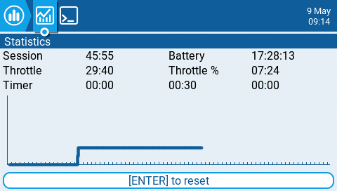
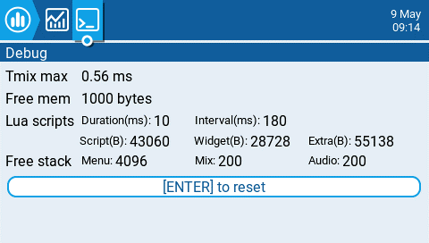

# Statistics

<figure><figcaption>
Statistics screen
</figcaption></figure>

The **Statistics** screen presents you with statistics regarding radio usage. Except for Battery, all data is reset once the radio is powered off. The following information is provided:

* **Session** - The amount of time that the radio has been turned on.&#x20;
* **Battery** - The amount of time that the radio has been on since the last reset.
* **Throttle** - The amount of time that the throttle has was above the 0% stick position.
* **Throttle %** - The amount of time that the throttle has was above the 50% stick position.
* **Timer** - The current values of Timer 1, Timer 2, Timer 3.

<figure><figcaption>
Debug Screen
</figcaption></figure>

The debug screen provides data points used by the developers when debugging issues in the software. Most users will not find the information useful on this screen unless debugging issues with developers. The following debug information is provided.

* **TMix max** - Maximum mixer task duration.
* **Free mem** - Current free radio memory in bytes.
* **Lua scripts**&#x20;
  * **Duration(ms) -** Maximum Lua duration in milliseconds.
  * **Interval(ms)** - Maximum Lua interval in milliseconds.
  * **Script(B)** - Memory used by LUA scripts.
  * **Widget(B)** - Memory used by LUA widgets.
  * **Extra(B)** - Memory used by LUA bitmap functions.
* **Free stack**
  * **\[Menu]** - Minimum free stack memory for menu tasks.
  * **\[Mix]** - Minimum free stack memory for mixer tasks.
  * **\[Audio]** - Minimum free stack memory for audio tasks.

