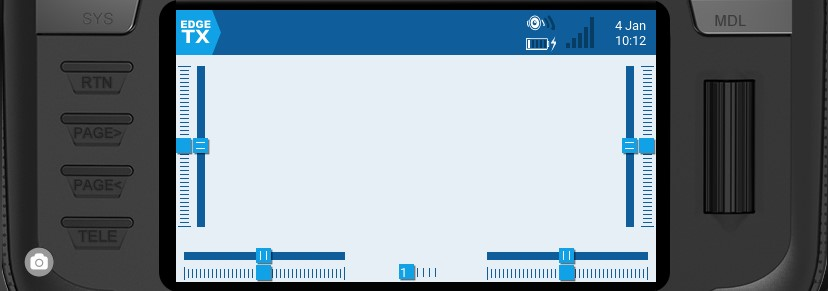
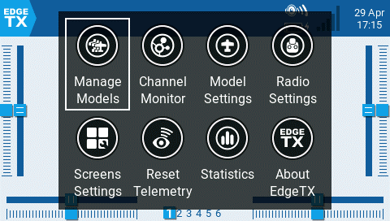

# User Interface

The user interface of EdgeTX can be navigated by physical buttons, the touch interface, or a combination of both.

<figure><figcaption>
Common buttons for navigation
</figcaption></figure>

### **Buttons:**

*   **\[SYS]** - System Button\
    \- Short press **\[SYS]** button to go to the [Radio Settings](../radio-settings/) page.&#x20;

    \- Long press the **\[SYS]** button to go to the [Radio Setup](../radio-settings/radio-setup/) page.
* **\[MDL]** - Model Button\
  \- Short press **\[MDL]** button to go to the [Model Settings](../model-settings/) page\
  \- Long press **\[MDL]** button to go to the [Select Model](../select-model.md) page
* **\[RTN] -** Return / Back \
  \- Short press **\[RTN]** button to return to the previous page, previous menu or cancel action
* **\[PAGE>] / \[PAGE<]** - Page next & page previous\
  \- Used to navigate between different screens, tabs, or options settings, depending on the screen.
*   **\[TELE] -** Telemetry \
    \- Short press the **\[TELE]** button to go to the [Screen Settings](../screen-settings/) page

    &#x20;\-Long press the **\[TELE]** button to go to the [Channel Monitor](../channel-monitor.md) page
* **\[Roller]** or **\[Dial]** - Next & previous value\
  The roller is used to navigate through menu options. &#x20;
* **\[Enter]** - Accept \
  \- Used to select option, function or accept value\
  \- Push **\[Roller]** or **\[Dial]** button to select or enter.

### Additional System and Model button functionalities

The system and model buttons have different functionalities based on what screen you are in the user interface:

**In the Radio Setup screen:**

* Short press **\[MDL]** navigates to the Model Setup screen
* Long press **\[MDL]** navigates to Manage Models screen

**In the Model Setup screen:**

* Short press **\[SYS]** navigates to the Radio Setup (TOOLS) screen
* Long press **\[SYS]** navigates to the Radio Setup (SETUP) screen
* Short press **\[MDL]** navigates to the Channel Monitor (existing function)
* Long press **\[MDL]** navigates to the Manage Models screen

**In the Channels Monitor screen:**

* Short press **\[MDL]** navigates to the Model Setup screen
* Long press **\[MDL]** navigates to the Manage Models screen
* Short press **\[SYS]** navigates to the Radio Setup (TOOLS) screen
* Long press **\[SYS]** navigates to the Radio Setup (SETUP) screen

**In the Manage Model screen:**

* Short press **\[MDL]** navigates to the Model Setup screen
* Short press **\[SYS]** navigates to the Radio Setup (TOOLS) screen
* Long press **\[SYS]** navigates to the Radio Setup (SETUP) screen

### **Touch Interface**:

Certain radios are equipped with a touch screen.  On these radios, you can interface with the menu options either with touch or physical buttons.&#x20;


It is possible to disable the touch interface by configuring a special function. See  [special-functions.md](../model-settings/special-functions.md "mention") for more information.


Touch the EdgeTX icon in the upper left corner of the screen to open the main navigation menu. Touch the desired menu option to select it.

<figure><figcaption>
Main navigation menu
</figcaption></figure>


For models that have a valid model checklist file in the **Models** folder, a **Model Notes** icon is added after the **Manage Models** icon.


Pressing the roller from the main screen will also open the main navigation menu. You can then scroll using the roller to the desired menu option and select it by pressing the roller.
