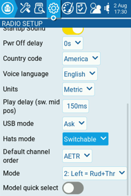
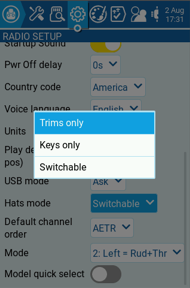
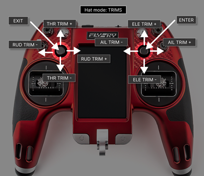

# Trim Navigation

On the NV14 and EL18 radios, it is possible to navigate the menu options using the Trim hat switches.

In the radio setup screen, you can configure the **Hats Mode** with one of the following options:

<figure><figcaption>
Hats mode option
</figcaption></figure>

 

<figure><figcaption>
Configuration options
</figcaption></figure>

 

<figure><figcaption>
Hats mode help text
</figcaption></figure>

* **Trims** **only**: The Trim hat switches will be used to adjust the trim values only.
* **Keys only**: The Trim hat switches will be used to navigate the menu options (as described below)
* **Switchable**: Trim hat switch functionality can be changed between **Trims** and **Keys** on-the-fly.

<figure><figcaption>
Keys mode
</figcaption></figure>

 

<figure><figcaption>
Trims mode
</figcaption></figure>

### To switch between modes on-the-fly

1. Configure **Hats Mode** as **Switchable**.
2. Press and hold the **Left Hat.**
3. Immediately after, press the **Right Hat**.


When the radio is powered up and Hats Mode is set to **Switchable**, the initial mode will always be set to **Trims**.


